# DESIGN.md
## Diagram Proses Penggunaan Model VUCA dan Middle Power Capabilities

### 1. Overview Sistem

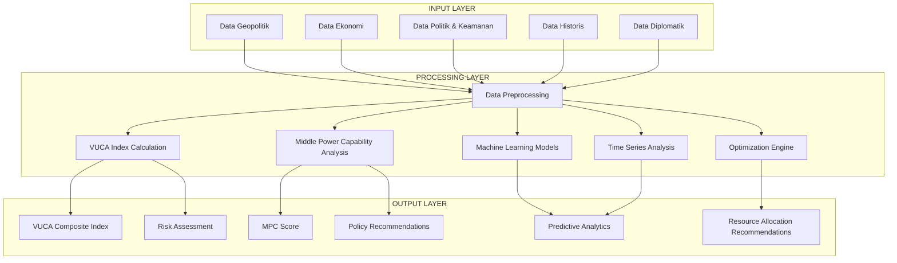

### 2. Workflow Penelitian Lengkap

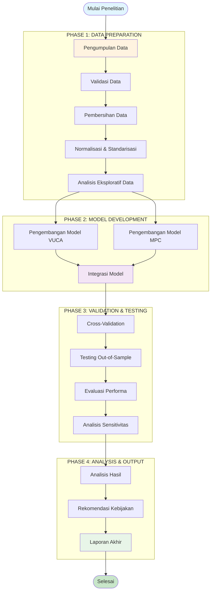

### 3. Proses Perhitungan VUCA Index

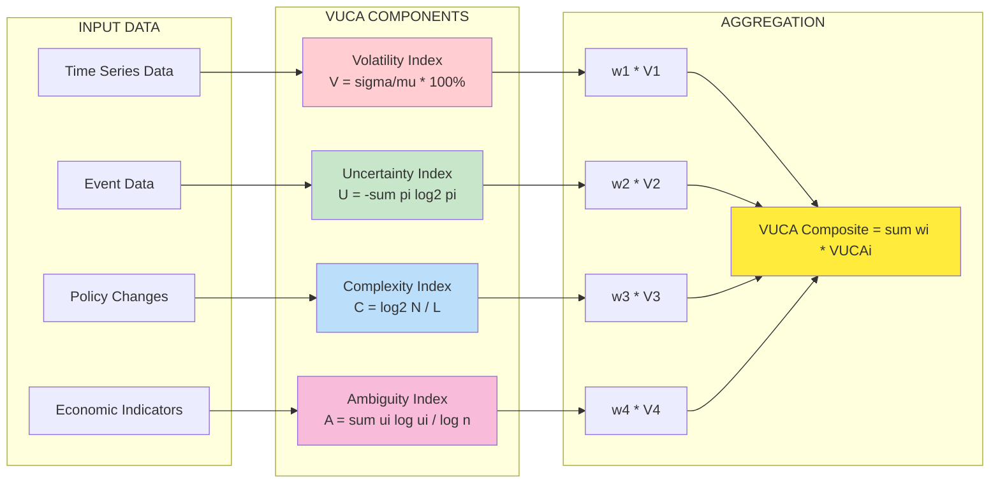

### 4. Proses Perhitungan Middle Power Capability Index

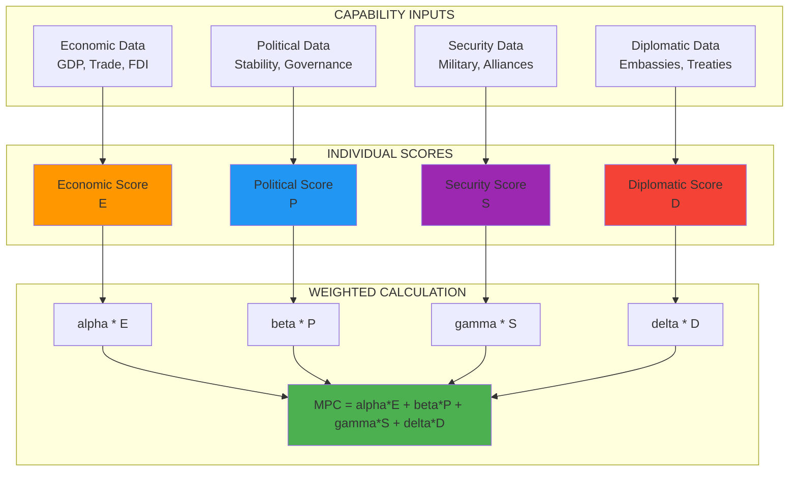

### 5. Machine Learning Pipeline

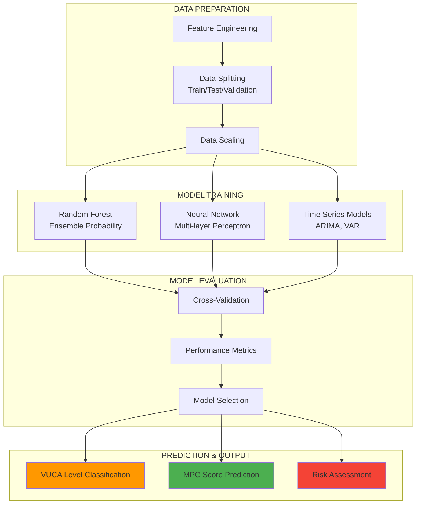

### 6. Optimization Engine Process

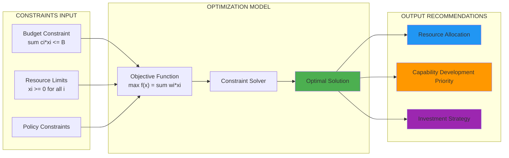

### 7. Time Series Analysis Flow

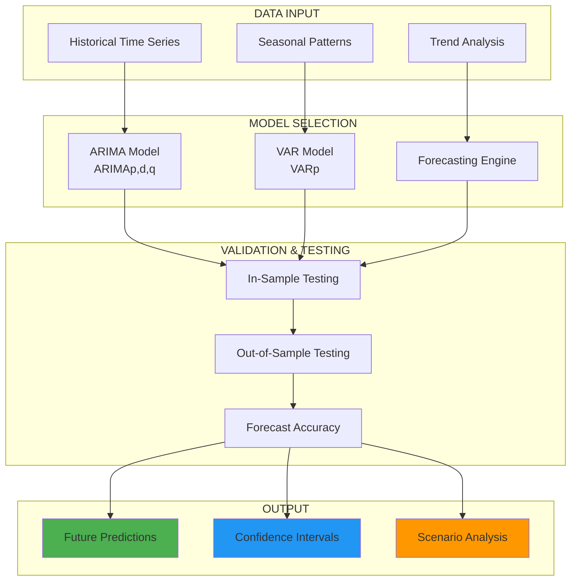

### 8. Bayesian Network Structure

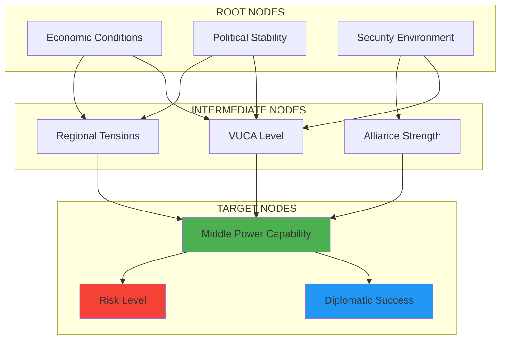

### 9. Monte Carlo Simulation Process

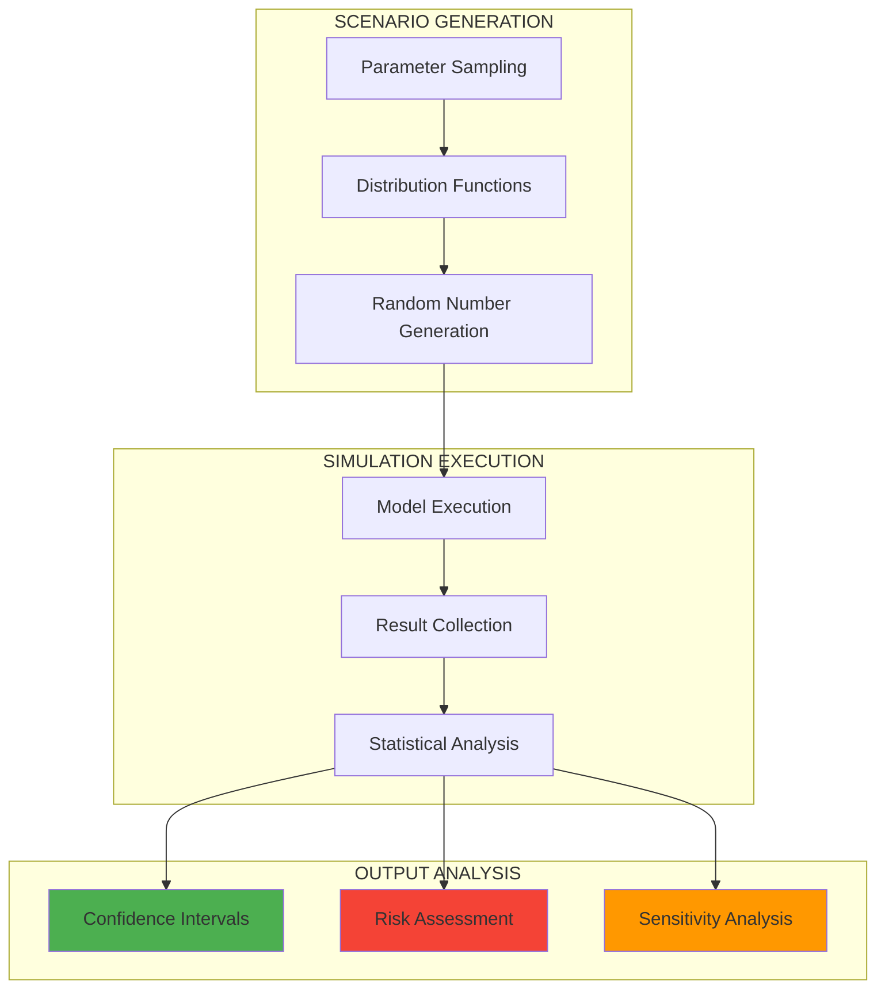

### 10. Complete System Integration

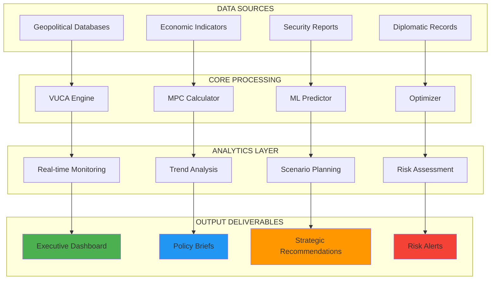

### 11. Data Flow Architecture

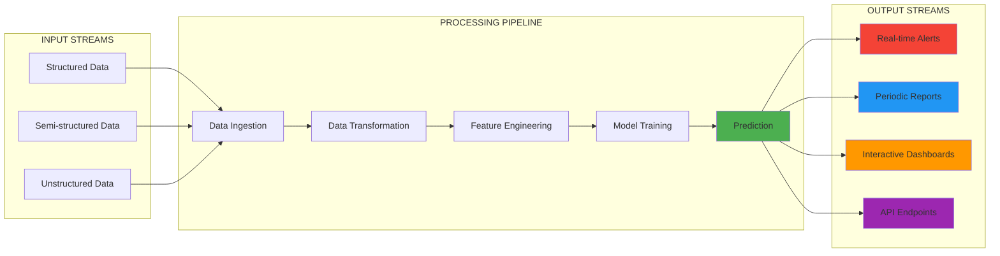

### 12. Key Performance Indicators (KPIs)

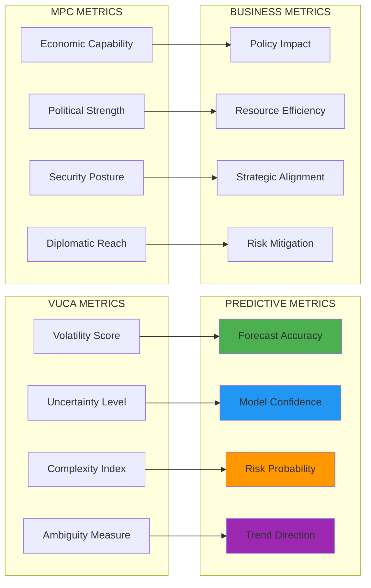

---

## Penjelasan Diagram

### 1. **Overview Sistem**
Diagram ini menunjukkan arsitektur keseluruhan sistem dengan tiga layer utama: Input, Processing, dan Output. Setiap layer memiliki komponen yang saling terhubung untuk menghasilkan analisis komprehensif.

### 2. **Workflow Penelitian**
Flowchart yang menggambarkan empat fase utama penelitian dari pengumpulan data hingga laporan akhir, dengan proses validasi dan testing yang ketat.

### 3. **Proses Perhitungan VUCA Index**
Menunjukkan bagaimana empat komponen VUCA (Volatility, Uncertainty, Complexity, Ambiguity) dihitung dan digabungkan menjadi indeks komposit.

### 4. **Proses Perhitungan Middle Power Capability Index**
Menggambarkan perhitungan MPC berdasarkan empat kapabilitas utama dengan bobot yang dapat disesuaikan.

### 5. **Machine Learning Pipeline**
Menunjukkan alur kerja machine learning dari data preparation hingga prediction dan output.

### 6. **Optimization Engine Process**
Menggambarkan proses optimisasi untuk alokasi sumber daya optimal berdasarkan constraint dan objective function.

### 7. **Time Series Analysis Flow**
Menunjukkan proses analisis time series menggunakan model ARIMA dan VAR untuk forecasting.

### 8. **Bayesian Network Structure**
Menggambarkan struktur jaringan Bayesian untuk analisis probabilitas dan dependensi antar variabel.

### 9. **Monte Carlo Simulation Process**
Menunjukkan proses simulasi Monte Carlo untuk analisis risiko dan sensitivitas.

### 10. **Complete System Integration**
Diagram integrasi sistem yang menunjukkan bagaimana semua komponen bekerja bersama.

### 11. **Data Flow Architecture**
Menggambarkan arsitektur alur data dari input hingga output dengan processing pipeline yang jelas.

### 12. **Key Performance Indicators**
Menunjukkan metrik-metrik utama untuk mengukur performa sistem dan model.

---

## Implementasi Praktis

### Teknologi yang Diperlukan:
- **Data Processing**: Python, Pandas, NumPy
- **Machine Learning**: Scikit-learn, TensorFlow, PyTorch
- **Visualization**: Matplotlib, Plotly, Tableau
- **Database**: PostgreSQL, MongoDB
- **API**: FastAPI, Flask
- **Deployment**: Docker, Kubernetes

### Monitoring dan Maintenance:
- Real-time dashboard untuk monitoring performa model
- Automated testing dan validation pipeline
- Regular model retraining dan update
- Performance metrics tracking
- Alert system untuk anomaly detection

---

*Dokumen ini memberikan blueprint lengkap untuk implementasi sistem analisis VUCA dan Middle Power Capabilities berdasarkan model matematis yang telah dikembangkan.*
