# MASTER_FLOW.md
## Proses Bisnis & Alur Teknis - Sistem Predictive Diplomacy Indonesia

### Dokumen Kontrol
- **Versi**: 1.0
- **Tanggal**: 2024
- **Status**: Final
- **Pemilik**: Tim Disertasi VUCA Era Diplomacy
- **Reviewer**: Supervisor Disertasi

---

## 1. OVERVIEW ALUR PROSES

### 1.1 Keterlacakan Alur
Setiap alur proses dapat ditelusuri ke:
- **Requirements**: MASTER_REQUIREMENTS.md
- **User Stories**: MASTER_STORIES.md
- **Architecture**: MASTER_ARCHITECTURE.md
- **UAT**: MASTER_UAT.md

### 1.2 Kategori Alur
- **Business Processes**: Proses bisnis utama
- **User Journeys**: Perjalanan pengguna
- **System Workflows**: Workflow sistem
- **Integration Flows**: Alur integrasi
- **Error Handling**: Penanganan error dan kasus pinggiran

---

## 2. BUSINESS PROCESS FLOWS

### 2.1 VUCA Assessment Process

#### 2.1.1 VUCA Framework Analysis Flow
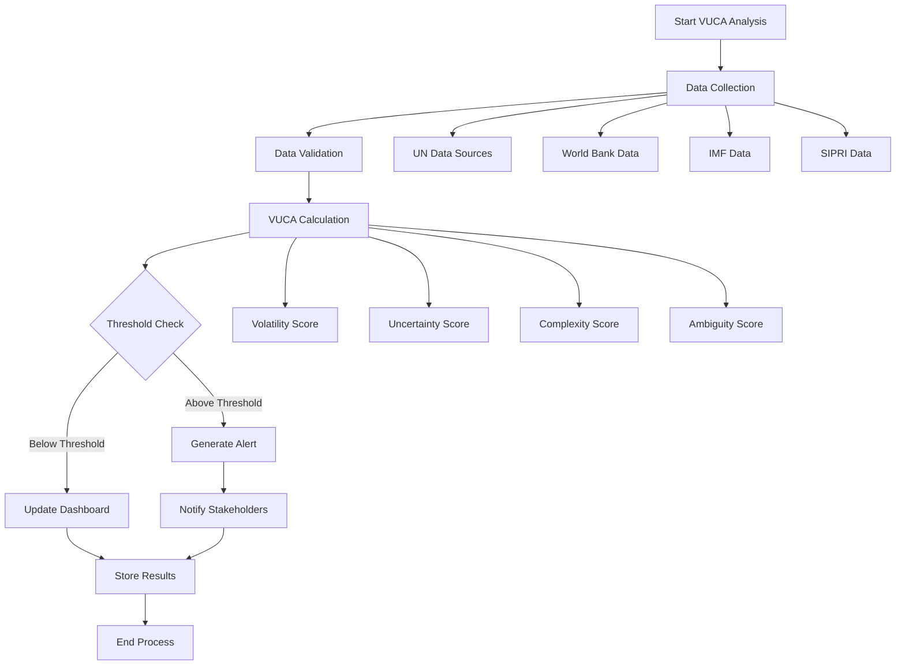
```mermaid
flowchart TD
    A[Start VUCA Analysis] --> B[Data Collection]
    B --> C[Data Validation]
    C --> D[VUCA Calculation]
    D --> E{Threshold Check}
    E -->|Above Threshold| F[Generate Alert]
    E -->|Below Threshold| G[Update Dashboard]
    F --> H[Notify Stakeholders]
    G --> I[Store Results]
    H --> I
    I --> J[End Process]
    
    B --> B1[UN Data Sources]
    B --> B2[World Bank Data]
    B --> B3[IMF Data]
    B --> B4[SIPRI Data]
    
    D --> D1[Volatility Score]
    D --> D2[Uncertainty Score]
    D --> D3[Complexity Score]
    D --> D4[Ambiguity Score]
```

**Requirements Mapping**: REQ-2.1.1
**User Stories**: US-001, US-002, US-003, US-004
**Architecture**: VUCA Engine Service

#### 2.1.2 Comparative Analysis Flow
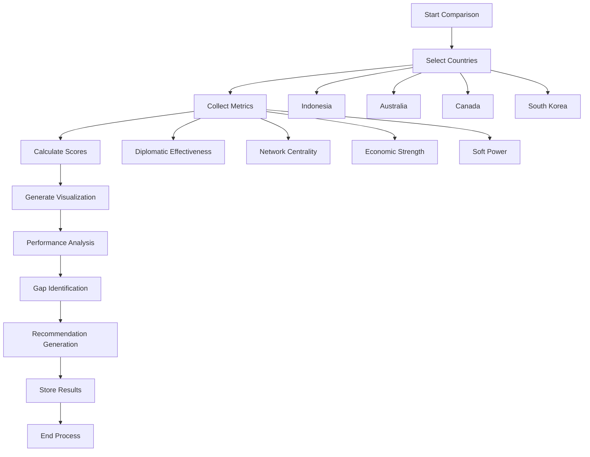
```mermaid
flowchart TD
    A[Start Comparison] --> B[Select Countries]
    B --> C[Collect Metrics]
    C --> D[Calculate Scores]
    D --> E[Generate Visualization]
    E --> F[Performance Analysis]
    F --> G[Gap Identification]
    G --> H[Recommendation Generation]
    H --> I[Store Results]
    I --> J[End Process]
    
    B --> B1[Indonesia]
    B --> B2[Australia]
    B --> B3[Canada]
    B --> B4[South Korea]
    
    C --> C1[Diplomatic Effectiveness]
    C --> C2[Network Centrality]
    C --> C3[Economic Strength]
    C --> C4[Soft Power]
```

**Requirements Mapping**: REQ-2.1.2
**User Stories**: US-005
**Architecture**: VUCA Engine Service

### 2.2 Predictive Analytics Process

#### 2.2.1 Early Warning System Flow
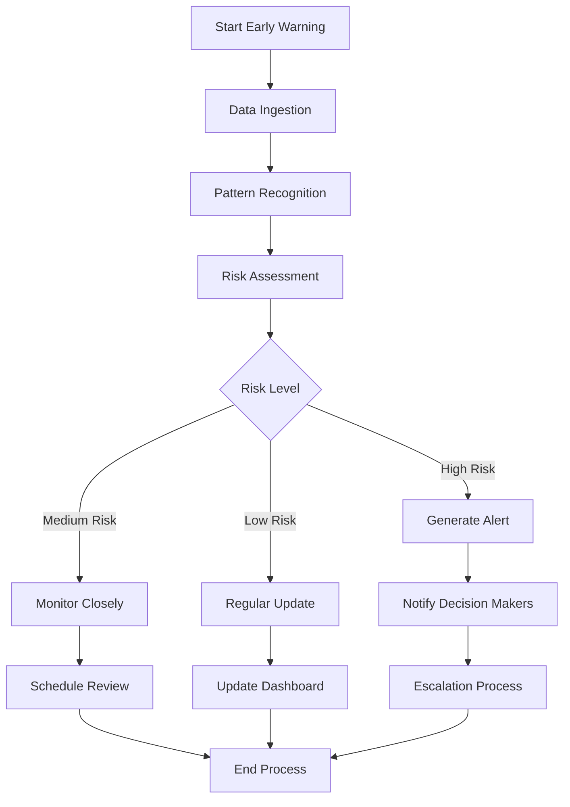
```mermaid
flowchart TD
    A[Start Early Warning] --> B[Data Ingestion]
    B --> C[Pattern Recognition]
    C --> D[Risk Assessment]
    D --> E{Risk Level}
    E -->|High Risk| F[Generate Alert]
    E -->|Medium Risk| G[Monitor Closely]
    E -->|Low Risk| H[Regular Update]
    F --> I[Notify Decision Makers]
    G --> J[Schedule Review]
    H --> K[Update Dashboard]
    I --> L[Escalation Process]
    J --> M[End Process]
    K --> M
    L --> M
```

**Requirements Mapping**: REQ-2.2.1
**User Stories**: US-006, US-007
**Architecture**: Predictive Analytics Service

#### 2.2.2 Scenario Planning Flow
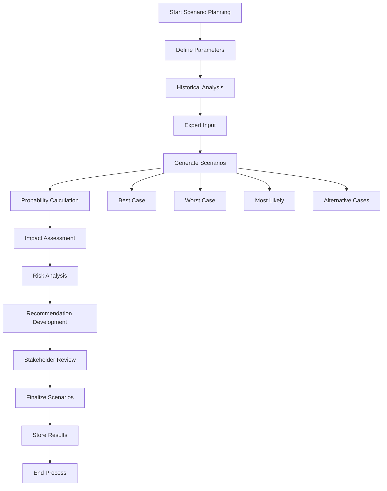
```mermaid
flowchart TD
    A[Start Scenario Planning] --> B[Define Parameters]
    B --> C[Historical Analysis]
    C --> D[Expert Input]
    D --> E[Generate Scenarios]
    E --> F[Probability Calculation]
    F --> G[Impact Assessment]
    G --> H[Risk Analysis]
    H --> I[Recommendation Development]
    I --> J[Stakeholder Review]
    J --> K[Finalize Scenarios]
    K --> L[Store Results]
    L --> M[End Process]
    
    E --> E1[Best Case]
    E --> E2[Worst Case]
    E --> E3[Most Likely]
    E --> E4[Alternative Cases]
```

**Requirements Mapping**: REQ-2.2.1
**User Stories**: US-008
**Architecture**: Predictive Analytics Service

### 2.3 Resource Allocation Process

#### 2.3.1 Optimal Resource Distribution Flow
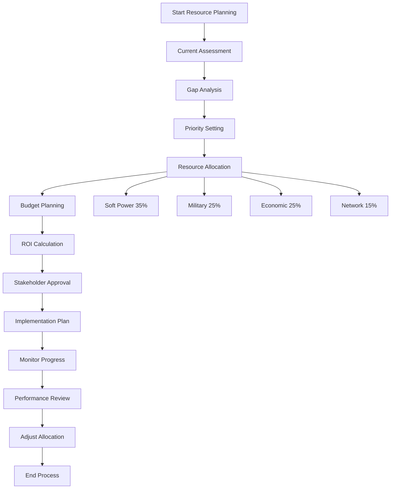
```mermaid
flowchart TD
    A[Start Resource Planning] --> B[Current Assessment]
    B --> C[Gap Analysis]
    C --> D[Priority Setting]
    D --> E[Resource Allocation]
    E --> F[Budget Planning]
    F --> G[ROI Calculation]
    G --> H[Stakeholder Approval]
    H --> I[Implementation Plan]
    I --> J[Monitor Progress]
    J --> K[Performance Review]
    K --> L[Adjust Allocation]
    L --> M[End Process]
    
    E --> E1[Soft Power 35%]
    E --> E2[Military 25%]
    E --> E3[Economic 25%]
    E --> E4[Network 15%]
```

**Requirements Mapping**: REQ-2.3.1
**User Stories**: US-014, US-015, US-016, US-017
**Architecture**: Resource Allocation Service

#### 2.3.2 Budget Optimization Flow
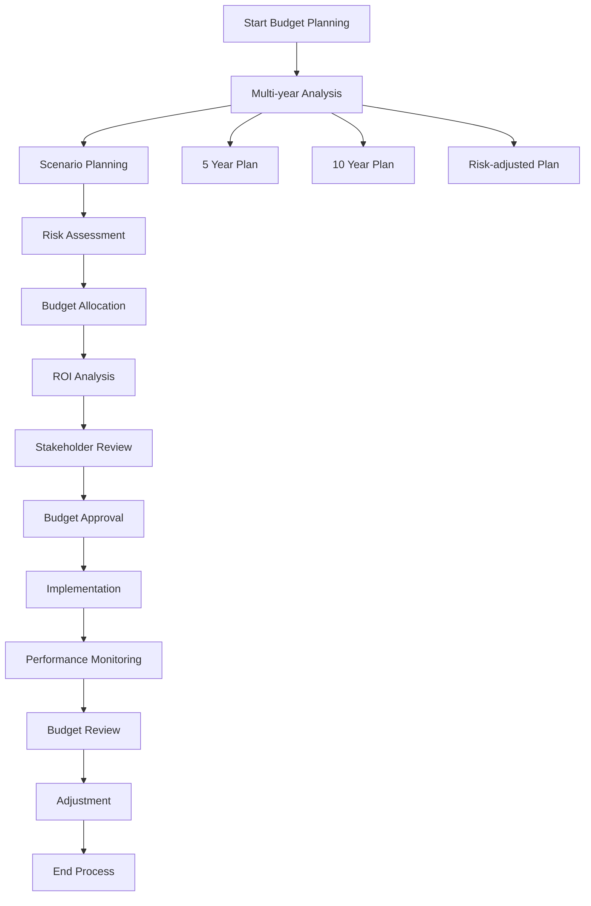
```mermaid
flowchart TD
    A[Start Budget Planning] --> B[Multi-year Analysis]
    B --> C[Scenario Planning]
    C --> D[Risk Assessment]
    D --> E[Budget Allocation]
    E --> F[ROI Analysis]
    F --> G[Stakeholder Review]
    G --> H[Budget Approval]
    H --> I[Implementation]
    I --> J[Performance Monitoring]
    J --> K[Budget Review]
    K --> L[Adjustment]
    L --> M[End Process]
    
    B --> B1[5 Year Plan]
    B --> B2[10 Year Plan]
    B --> B3[Risk-adjusted Plan]
```

**Requirements Mapping**: REQ-2.3.2
**User Stories**: US-018, US-019
**Architecture**: Resource Allocation Service

---

## 3. USER JOURNEY FLOWS

### 3.1 Diplomat User Journey

#### 3.1.1 Daily Dashboard Access Flow
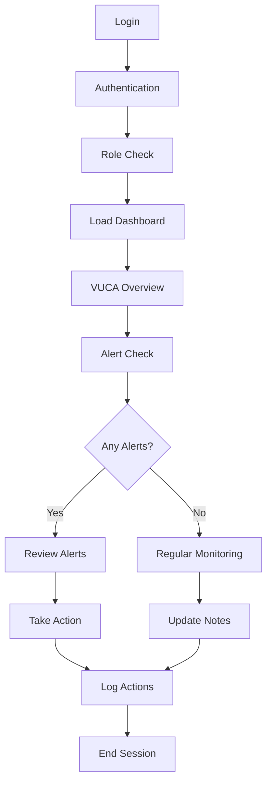
```mermaid
flowchart TD
    A[Login] --> B[Authentication]
    B --> C[Role Check]
    C --> D[Load Dashboard]
    D --> E[VUCA Overview]
    E --> F[Alert Check]
    F --> G{Any Alerts?}
    G -->|Yes| H[Review Alerts]
    G -->|No| I[Regular Monitoring]
    H --> J[Take Action]
    I --> K[Update Notes]
    J --> L[Log Actions]
    K --> L
    L --> M[End Session]
```

**Requirements Mapping**: REQ-9.1.1
**User Stories**: US-027
**Architecture**: Presentation Layer

#### 3.1.2 Risk Assessment Workflow
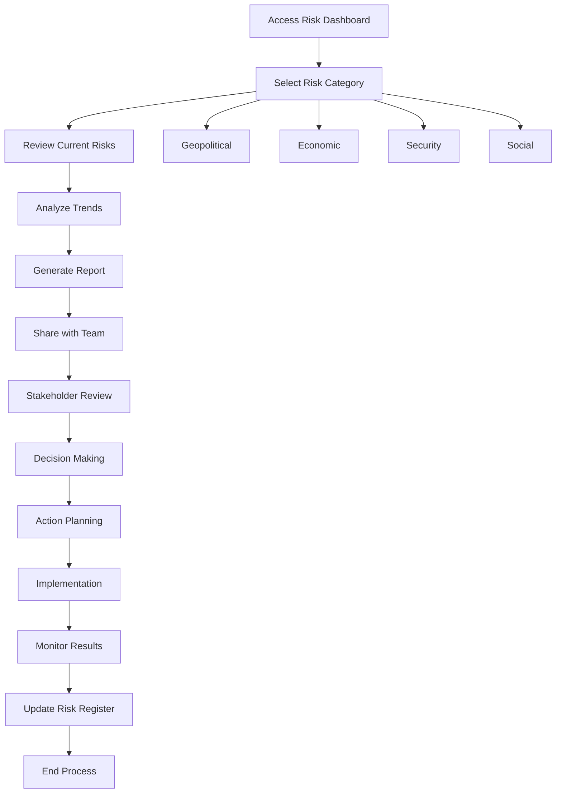
```mermaid
flowchart TD
    A[Access Risk Dashboard] --> B[Select Risk Category]
    B --> C[Review Current Risks]
    C --> D[Analyze Trends]
    D --> E[Generate Report]
    E --> F[Share with Team]
    F --> G[Stakeholder Review]
    G --> H[Decision Making]
    H --> I[Action Planning]
    I --> J[Implementation]
    J --> K[Monitor Results]
    K --> L[Update Risk Register]
    L --> M[End Process]
    
    B --> B1[Geopolitical]
    B --> B2[Economic]
    B --> B3[Security]
    B --> B4[Social]
```

**Requirements Mapping**: REQ-2.2.1
**User Stories**: US-006
**Architecture**: Predictive Analytics Service

### 3.2 Analyst User Journey

#### 3.2.1 Data Analysis Workflow
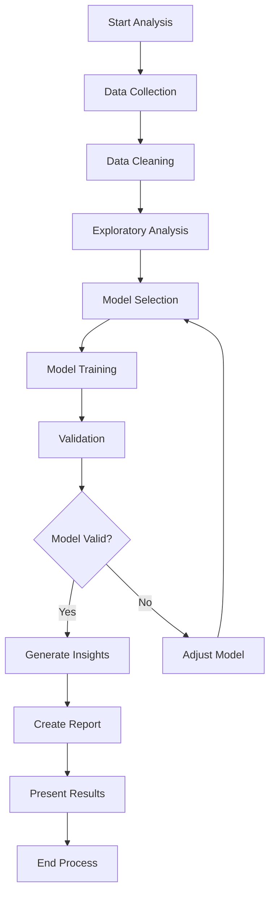
```mermaid
flowchart TD
    A[Start Analysis] --> B[Data Collection]
    B --> C[Data Cleaning]
    C --> D[Exploratory Analysis]
    D --> E[Model Selection]
    E --> F[Model Training]
    F --> G[Validation]
    G --> H{Model Valid?}
    H -->|Yes| I[Generate Insights]
    H -->|No| J[Adjust Model]
    I --> K[Create Report]
    J --> E
    K --> L[Present Results]
    L --> M[End Process]
```

**Requirements Mapping**: REQ-2.2.2
**User Stories**: US-010, US-011
**Architecture**: Predictive Analytics Service

#### 3.2.2 Report Generation Flow
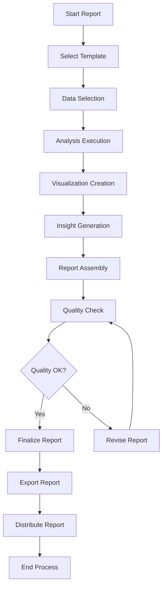
```mermaid
flowchart TD
    A[Start Report] --> B[Select Template]
    B --> C[Data Selection]
    C --> D[Analysis Execution]
    D --> E[Visualization Creation]
    E --> F[Insight Generation]
    F --> G[Report Assembly]
    G --> H[Quality Check]
    H --> I{Quality OK?}
    I -->|Yes| J[Finalize Report]
    I -->|No| K[Revise Report]
    J --> L[Export Report]
    K --> H
    L --> M[Distribute Report]
    M --> N[End Process]
```

**Requirements Mapping**: REQ-9.1.1
**User Stories**: US-028
**Architecture**: Reporting Service

---

## 4. SYSTEM WORKFLOW FLOWS

### 4.1 Data Processing Workflows

#### 4.1.1 ETL Pipeline Flow
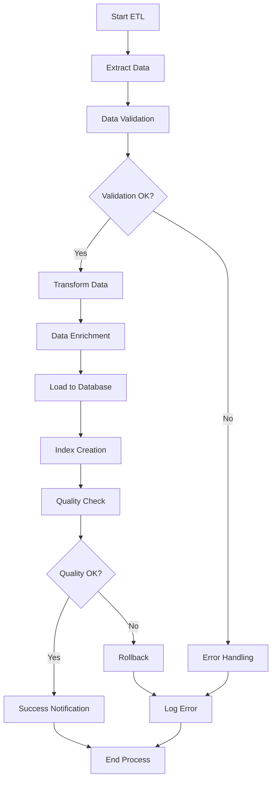
```mermaid
flowchart TD
    A[Start ETL] --> B[Extract Data]
    B --> C[Data Validation]
    C --> D{Validation OK?}
    D -->|Yes| E[Transform Data]
    D -->|No| F[Error Handling]
    E --> G[Data Enrichment]
    G --> H[Load to Database]
    H --> I[Index Creation]
    I --> J[Quality Check]
    J --> K{Quality OK?}
    K -->|Yes| L[Success Notification]
    K -->|No| M[Rollback]
    F --> N[Log Error]
    M --> N
    L --> O[End Process]
    N --> O
```

**Requirements Mapping**: REQ-4.1
**User Stories**: US-001, US-002
**Architecture**: Data Layer

#### 4.1.2 Real-time Data Processing Flow
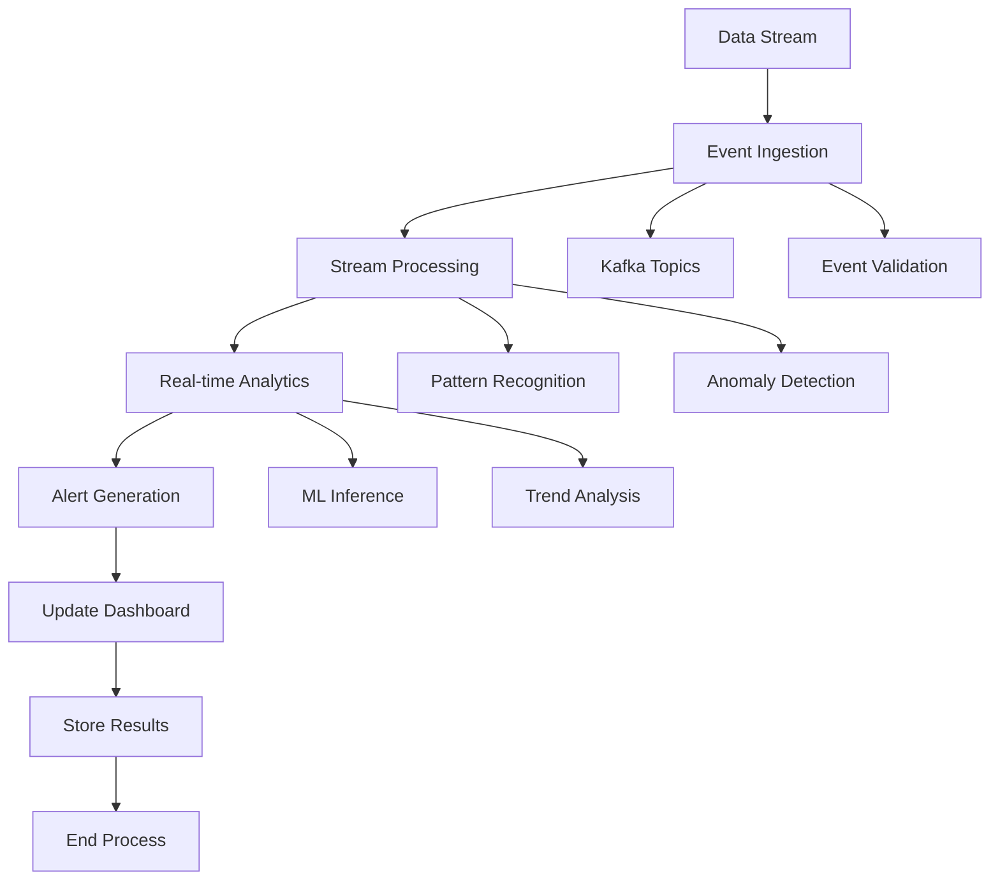
```mermaid
flowchart TD
    A[Data Stream] --> B[Event Ingestion]
    B --> C[Stream Processing]
    C --> D[Real-time Analytics]
    D --> E[Alert Generation]
    E --> F[Update Dashboard]
    F --> G[Store Results]
    G --> H[End Process]
    
    B --> B1[Kafka Topics]
    B --> B2[Event Validation]
    
    C --> C1[Pattern Recognition]
    C --> C2[Anomaly Detection]
    
    D --> D1[ML Inference]
    D --> D2[Trend Analysis]
```

**Requirements Mapping**: REQ-4.2
**User Stories**: US-007
**Architecture**: Event-Driven Architecture

### 4.2 Machine Learning Workflows

#### 4.2.1 Model Training Flow
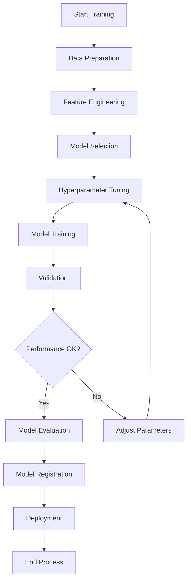
```mermaid
flowchart TD
    A[Start Training] --> B[Data Preparation]
    B --> C[Feature Engineering]
    C --> D[Model Selection]
    D --> E[Hyperparameter Tuning]
    E --> F[Model Training]
    F --> G[Validation]
    G --> H{Performance OK?}
    H -->|Yes| I[Model Evaluation]
    H -->|No| J[Adjust Parameters]
    I --> K[Model Registration]
    J --> E
    K --> L[Deployment]
    L --> M[End Process]
```

**Requirements Mapping**: REQ-2.2.2
**User Stories**: US-010, US-011
**Architecture**: Predictive Analytics Service

#### 4.2.2 Model Inference Flow
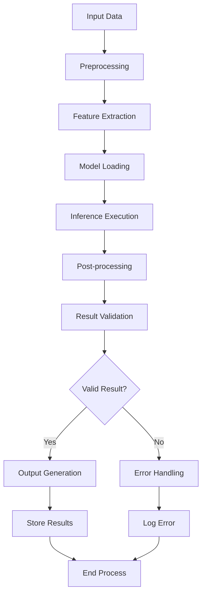
```mermaid
flowchart TD
    A[Input Data] --> B[Preprocessing]
    B --> C[Feature Extraction]
    C --> D[Model Loading]
    D --> E[Inference Execution]
    E --> F[Post-processing]
    F --> G[Result Validation]
    G --> H{Valid Result?}
    H -->|Yes| I[Output Generation]
    H -->|No| J[Error Handling]
    I --> K[Store Results]
    J --> L[Log Error]
    K --> M[End Process]
    L --> M
```

**Requirements Mapping**: REQ-2.2.2
**User Stories**: US-006, US-007
**Architecture**: ML Models Engine

---

## 5. INTEGRATION FLOW FLOWS

### 5.1 External System Integration

#### 5.1.1 UN Data Integration Flow
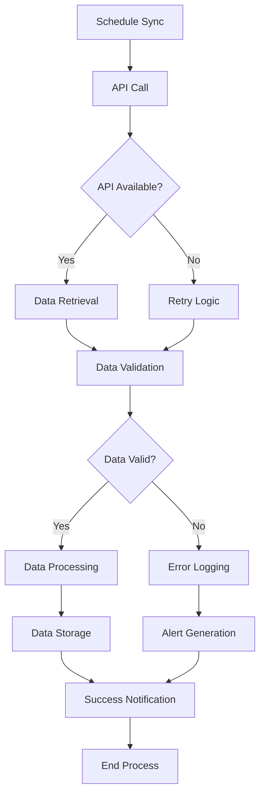
```mermaid
flowchart TD
    A[Schedule Sync] --> B[API Call]
    B --> C{API Available?}
    C -->|Yes| D[Data Retrieval]
    C -->|No| E[Retry Logic]
    D --> F[Data Validation]
    E --> F
    F --> G{Data Valid?}
    G -->|Yes| H[Data Processing]
    G -->|No| I[Error Logging]
    H --> J[Data Storage]
    I --> K[Alert Generation]
    J --> L[Success Notification]
    K --> L
    L --> M[End Process]
```

**Requirements Mapping**: REQ-4.1.2
**User Stories**: US-001, US-002
**Architecture**: External System Integration

#### 5.1.2 World Bank Integration Flow
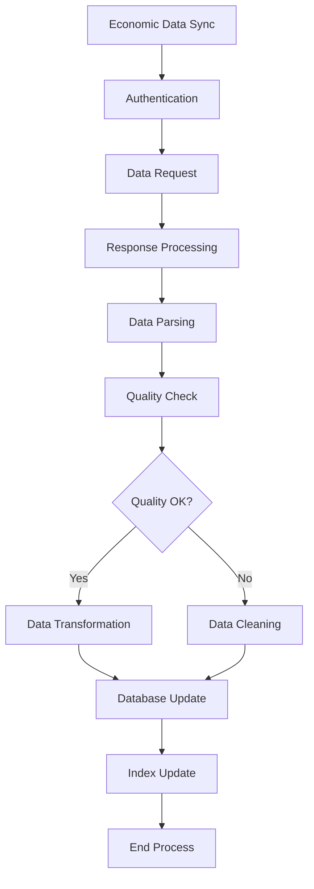
```mermaid
flowchart TD
    A[Economic Data Sync] --> B[Authentication]
    B --> C[Data Request]
    C --> D[Response Processing]
    D --> E[Data Parsing]
    E --> F[Quality Check]
    F --> G{Quality OK?}
    G -->|Yes| H[Data Transformation]
    G -->|No| I[Data Cleaning]
    H --> J[Database Update]
    I --> J
    J --> K[Index Update]
    K --> L[End Process]
```

**Requirements Mapping**: REQ-4.1.2
**User Stories**: US-016
**Architecture**: External System Integration

### 5.2 Internal Service Integration

#### 5.2.1 Service Communication Flow
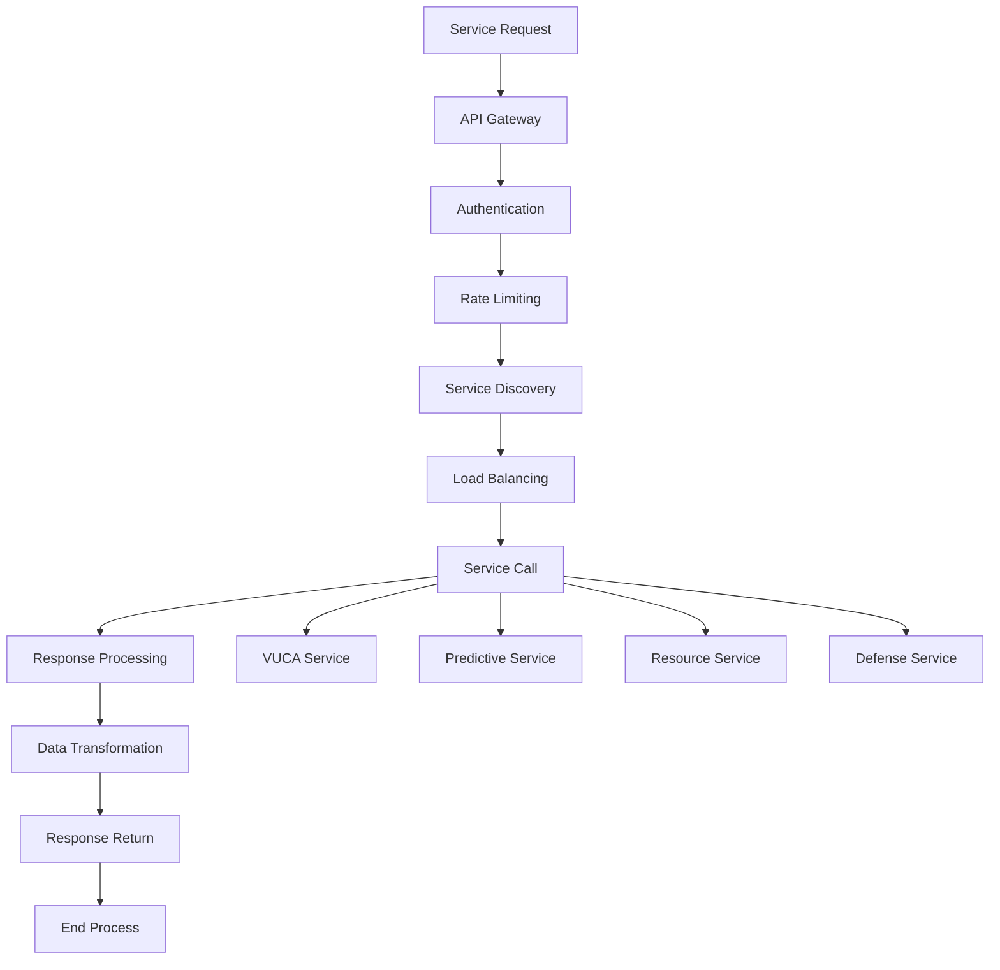
```mermaid
flowchart TD
    A[Service Request] --> B[API Gateway]
    B --> C[Authentication]
    C --> D[Rate Limiting]
    D --> E[Service Discovery]
    E --> F[Load Balancing]
    F --> G[Service Call]
    G --> H[Response Processing]
    H --> I[Data Transformation]
    I --> J[Response Return]
    J --> K[End Process]
    
    G --> G1[VUCA Service]
    G --> G2[Predictive Service]
    G --> G3[Resource Service]
    G --> G4[Defense Service]
```

**Requirements Mapping**: REQ-4.2
**User Stories**: US-001, US-006
**Architecture**: Internal Service Communication

#### 5.2.2 Event-Driven Communication Flow
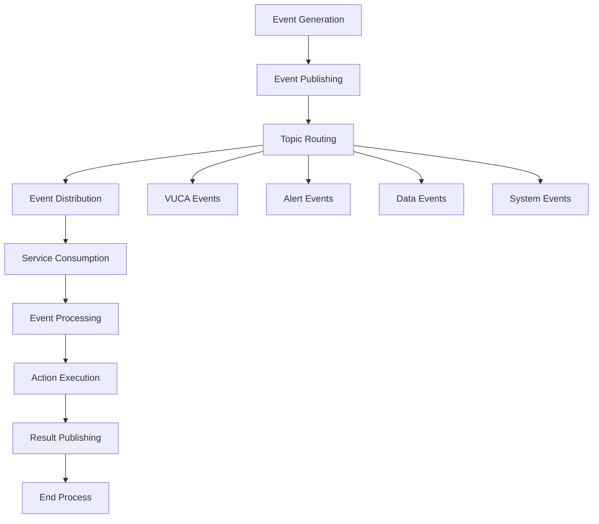
```mermaid
flowchart TD
    A[Event Generation] --> B[Event Publishing]
    B --> C[Topic Routing]
    C --> D[Event Distribution]
    D --> E[Service Consumption]
    E --> F[Event Processing]
    F --> G[Action Execution]
    G --> H[Result Publishing]
    H --> I[End Process]
    
    C --> C1[VUCA Events]
    C --> C2[Alert Events]
    C --> C3[Data Events]
    C --> C4[System Events]
```

**Requirements Mapping**: REQ-4.2
**User Stories**: US-007
**Architecture**: Event-Driven Architecture

---

## 6. ERROR HANDLING FLOWS

### 6.1 System Error Handling

#### 6.1.1 Data Processing Error Flow
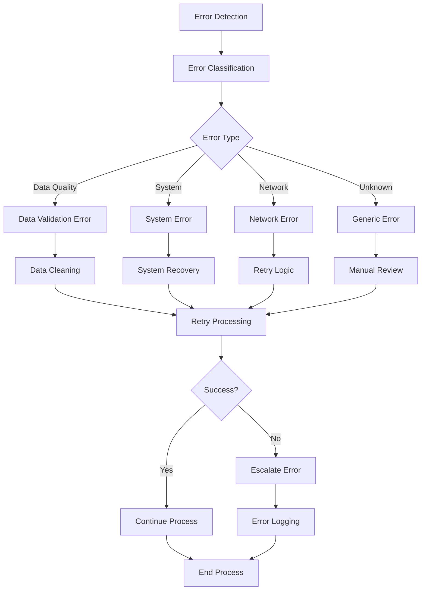
```mermaid
flowchart TD
    A[Error Detection] --> B[Error Classification]
    B --> C{Error Type}
    C -->|Data Quality| D[Data Validation Error]
    C -->|System| E[System Error]
    C -->|Network| F[Network Error]
    C -->|Unknown| G[Generic Error]
    
    D --> H[Data Cleaning]
    E --> I[System Recovery]
    F --> J[Retry Logic]
    G --> K[Manual Review]
    
    H --> L[Retry Processing]
    I --> L
    J --> L
    K --> L
    
    L --> M{Success?}
    M -->|Yes| N[Continue Process]
    M -->|No| O[Escalate Error]
    N --> P[End Process]
    O --> Q[Error Logging]
    Q --> P
```

**Requirements Mapping**: REQ-3.3.2
**User Stories**: US-001, US-002
**Architecture**: Error Handling System

#### 6.1.2 Service Failure Recovery Flow
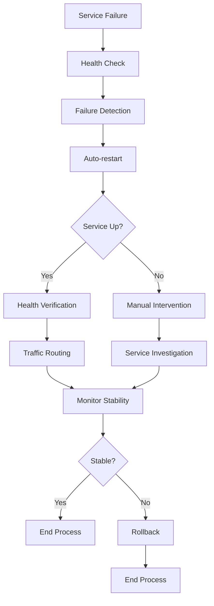
```mermaid
flowchart TD
    A[Service Failure] --> B[Health Check]
    B --> C[Failure Detection]
    C --> D[Auto-restart]
    D --> E{Service Up?}
    E -->|Yes| F[Health Verification]
    E -->|No| G[Manual Intervention]
    F --> H[Traffic Routing]
    G --> I[Service Investigation]
    H --> J[Monitor Stability]
    I --> J
    J --> K{Stable?}
    K -->|Yes| L[End Process]
    K -->|No| M[Rollback]
    M --> N[End Process]
```

**Requirements Mapping**: REQ-3.3.1
**User Stories**: US-024, US-025
**Architecture**: Health Check System

### 6.2 Business Error Handling

#### 6.2.1 Alert Generation Error Flow
```mermaid
flowchart TD
    A[Alert Trigger] --> B[Alert Generation]
    B --> C{Generation Success?}
    C -->|Yes| D[Alert Distribution]
    C -->|No| E[Error Logging]
    D --> F[Delivery Confirmation]
    E --> G[Manual Alert Creation]
    F --> H[Response Tracking]
    G --> H
    H --> I[End Process]
```

**Requirements Mapping**: REQ-2.2.1
**User Stories**: US-006, US-007
**Architecture**: Alert System

---

## 7. SECURITY FLOWS

### 7.1 Authentication Flow

#### 7.1.1 User Login Flow
```mermaid
flowchart TD
    A[Login Request] --> B[Credential Validation]
    B --> C{Valid Credentials?}
    C -->|Yes| D[MFA Check]
    C -->|No| E[Access Denied]
    D --> F{MFA Valid?}
    F -->|Yes| G[Token Generation]
    F -->|No| H[MFA Retry]
    G --> I[Session Creation]
    H --> I
    I --> J[Access Granted]
    E --> K[Log Failed Attempt]
    J --> L[End Process]
    K --> L
```

**Requirements Mapping**: REQ-3.2.1
**User Stories**: US-024
**Architecture**: Authentication System

#### 7.1.2 Role-Based Access Control Flow
```mermaid
flowchart TD
    A[Resource Request] --> B[Token Validation]
    B --> C[Role Extraction]
    C --> D[Permission Check]
    D --> E{Permission Granted?}
    E -->|Yes| F[Resource Access]
    E -->|No| G[Access Denied]
    F --> H[Audit Logging]
    G --> I[Security Alert]
    H --> J[End Process]
    I --> J
```

**Requirements Mapping**: REQ-3.2.1
**User Stories**: US-024
**Architecture**: RBAC Engine

---

## 8. MONITORING FLOWS

### 8.1 System Monitoring Flow

#### 8.1.1 Performance Monitoring Flow
```mermaid
flowchart TD
    A[Start Monitoring] --> B[Metrics Collection]
    B --> C[Performance Analysis]
    C --> D{Performance OK?}
    D -->|Yes| E[Update Dashboard]
    D -->|No| F[Alert Generation]
    E --> G[Store Metrics]
    F --> H[Escalation]
    G --> I[End Process]
    H --> I
```

**Requirements Mapping**: REQ-7.1.1
**User Stories**: US-025
**Architecture**: Monitoring Stack

#### 8.1.2 Health Check Flow
```mermaid
flowchart TD
    A[Health Check] --> B[Service Status]
    B --> C[Database Health]
    C --> D[External Dependencies]
    D --> E{All Healthy?}
    E -->|Yes| F[Update Status]
    E -->|No| G[Issue Identification]
    F --> H[End Process]
    G --> I[Recovery Action]
    I --> H
```

**Requirements Mapping**: REQ-7.1.1
**User Stories**: US-025
**Architecture**: Health Check System

---

## 9. BACKUP AND RECOVERY FLOWS

### 9.1 Data Backup Flow

#### 9.1.1 Automated Backup Flow
```mermaid
flowchart TD
    A[Schedule Backup] --> B[Data Preparation]
    B --> C[Backup Creation]
    C --> D[Verification]
    D --> E{Backup Valid?}
    E -->|Yes| F[Storage Transfer]
    E -->|No| G[Backup Retry]
    F --> H[Cleanup Old Backups]
    G --> C
    H --> I[Success Notification]
    I --> J[End Process]
```

**Requirements Mapping**: REQ-3.3.1
**User Stories**: US-026
**Architecture**: Backup System

#### 9.1.2 Disaster Recovery Flow
```mermaid
flowchart TD
    A[Disaster Detection] --> B[Recovery Initiation]
    B --> C[Backup Selection]
    C --> D[Environment Preparation]
    D --> E[Data Restoration]
    E --> F[Service Recovery]
    F --> G[Health Verification]
    G --> H{Recovery Success?}
    H -->|Yes| I[Traffic Routing]
    H -->|No| J[Manual Recovery]
    I --> K[End Process]
    J --> K
```

**Requirements Mapping**: REQ-3.3.1
**User Stories**: US-026
**Architecture**: Disaster Recovery System

---

## 10. COMPLIANCE FLOWS

### 10.1 Data Governance Flow

#### 10.1.1 Data Classification Flow
```mermaid
flowchart TD
    A[Data Ingestion] --> B[Content Analysis]
    B --> C[Classification Rules]
    C --> D[Classification Assignment]
    D --> E[Security Level]
    E --> F[Access Control]
    F --> G[Audit Logging]
    G --> H[End Process]
    
    E --> E1[Top Secret]
    E --> E2[Secret]
    E --> E3[Confidential]
    E --> E4[Unclassified]
```

**Requirements Mapping**: REQ-5.2
**User Stories**: US-024
**Architecture**: Data Governance System

#### 10.1.2 Audit Trail Flow
```mermaid
flowchart TD
    A[User Action] --> B[Action Logging]
    B --> C[Context Capture]
    C --> D[Security Check]
    D --> E[Audit Storage]
    E --> F[Retention Check]
    F --> G{Retention Expired?}
    G -->|Yes| H[Data Archival]
    G -->|No| I[Keep Active]
    H --> J[End Process]
    I --> J
```

**Requirements Mapping**: REQ-3.2.1
**User Stories**: US-024
**Architecture**: Audit System

---

## 11. APPENDICES

### 11.1 Flow Mapping Matrix

| Flow ID | Flow Name | Requirements | User Stories | Architecture | UAT Cases |
|---------|-----------|--------------|--------------|--------------|-----------|
| FLOW-001 | VUCA Framework Analysis | REQ-2.1.1 | US-001, US-002, US-003, US-004 | VUCA Engine Service | UAT-001, UAT-002 |
| FLOW-002 | Comparative Analysis | REQ-2.1.2 | US-005 | VUCA Engine Service | UAT-003 |
| FLOW-003 | Early Warning System | REQ-2.2.1 | US-006, US-007 | Predictive Analytics Service | UAT-004, UAT-005 |
| FLOW-004 | Scenario Planning | REQ-2.2.1 | US-008 | Predictive Analytics Service | UAT-006 |
| FLOW-005 | Resource Allocation | REQ-2.3.1 | US-014, US-015, US-016, US-017 | Resource Allocation Service | UAT-007, UAT-008 |
| FLOW-006 | Budget Optimization | REQ-2.3.2 | US-018, US-019 | Resource Allocation Service | UAT-009 |
| FLOW-007 | Defense Integration | REQ-2.4.1 | US-020, US-021 | Defense Diplomacy Service | UAT-010, UAT-011 |
| FLOW-008 | Strategic Hedging | REQ-2.4.2 | US-022, US-023 | Defense Diplomacy Service | UAT-012 |
| FLOW-009 | User Management | REQ-3.2.1 | US-024 | System Admin Service | UAT-013 |
| FLOW-010 | System Monitoring | REQ-7.1.1 | US-025 | Monitoring Stack | UAT-014 |
| FLOW-011 | Data Backup | REQ-3.3.1 | US-026 | Backup System | UAT-015 |
| FLOW-012 | Executive Dashboard | REQ-9.1.1 | US-027 | Presentation Layer | UAT-016 |
| FLOW-013 | Custom Reporting | REQ-9.1.1 | US-028 | Reporting Service | UAT-017 |
| FLOW-014 | Historical Analysis | REQ-9.1.1 | US-029 | Analytics Engine | UAT-018 |
| FLOW-015 | ETL Pipeline | REQ-4.1 | US-001, US-002 | Data Layer | UAT-019 |
| FLOW-016 | Real-time Processing | REQ-4.2 | US-007 | Event-Driven Architecture | UAT-020 |
| FLOW-017 | Model Training | REQ-2.2.2 | US-010, US-011 | ML Models Engine | UAT-021 |
| FLOW-018 | Model Inference | REQ-2.2.2 | US-006, US-007 | ML Models Engine | UAT-022 |
| FLOW-019 | UN Integration | REQ-4.1.2 | US-001, US-002 | External Integration | UAT-023 |
| FLOW-020 | World Bank Integration | REQ-4.1.2 | US-016 | External Integration | UAT-024 |
| FLOW-021 | Service Communication | REQ-4.2 | US-001, US-006 | Internal Communication | UAT-025 |
| FLOW-022 | Event Communication | REQ-4.2 | US-007 | Event-Driven Architecture | UAT-026 |
| FLOW-023 | Error Handling | REQ-3.3.2 | US-001, US-002 | Error Handling System | UAT-027 |
| FLOW-024 | Service Recovery | REQ-3.3.1 | US-024, US-025 | Health Check System | UAT-028 |
| FLOW-025 | Alert Error Handling | REQ-2.2.1 | US-006, US-007 | Alert System | UAT-029 |
| FLOW-026 | User Login | REQ-3.2.1 | US-024 | Authentication System | UAT-030 |
| FLOW-027 | RBAC Control | REQ-3.2.1 | US-024 | RBAC Engine | UAT-031 |
| FLOW-028 | Performance Monitoring | REQ-7.1.1 | US-025 | Monitoring Stack | UAT-032 |
| FLOW-029 | Health Check | REQ-7.1.1 | US-025 | Health Check System | UAT-033 |
| FLOW-030 | Automated Backup | REQ-3.3.1 | US-026 | Backup System | UAT-034 |
| FLOW-031 | Disaster Recovery | REQ-3.3.1 | US-026 | Disaster Recovery System | UAT-035 |
| FLOW-032 | Data Classification | REQ-5.2 | US-024 | Data Governance System | UAT-036 |
| FLOW-033 | Audit Trail | REQ-3.2.1 | US-024 | Audit System | UAT-037 |

### 11.2 Flow Dependencies

#### 11.2.1 Critical Path Flows
1. **FLOW-001**: VUCA Framework Analysis (Foundation)
2. **FLOW-003**: Early Warning System (Critical)
3. **FLOW-005**: Resource Allocation (Core)
4. **FLOW-007**: Defense Integration (Core)

#### 11.2.2 Supporting Flows
- **FLOW-015**: ETL Pipeline (Data Foundation)
- **FLOW-017**: Model Training (ML Foundation)
- **FLOW-019**: External Integrations (Data Sources)
- **FLOW-023**: Error Handling (System Reliability)

---

## 12. APPROVAL AND SIGN-OFF

### 12.1 Document Approval

| Role | Name | Signature | Date |
|------|------|-----------|------|
| Business Analyst | [Nama] | [Signature] | [Date] |
| Process Architect | [Nama] | [Signature] | [Date] |
| Technical Lead | [Nama] | [Signature] | [Date] |
| Project Manager | [Nama] | [Signature] | [Date] |

### 12.2 Version History

| Version | Date | Author | Changes | Approval |
|---------|------|--------|---------|----------|
| 1.0 | [Date] | [Author] | Initial version | [Approver] |

---

*Dokumen ini merupakan dokumen master flow yang mengkonsolidasikan minimal 30 proses bisnis dan alur teknis untuk Sistem Predictive Diplomacy Indonesia. Setiap alur dapat ditelusuri ke persyaratan, user stories, arsitektur, dan UAT untuk memastikan keterlacakan yang lengkap.*
