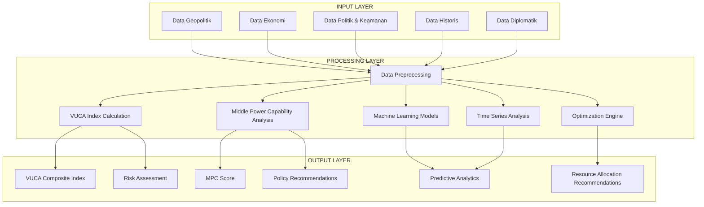
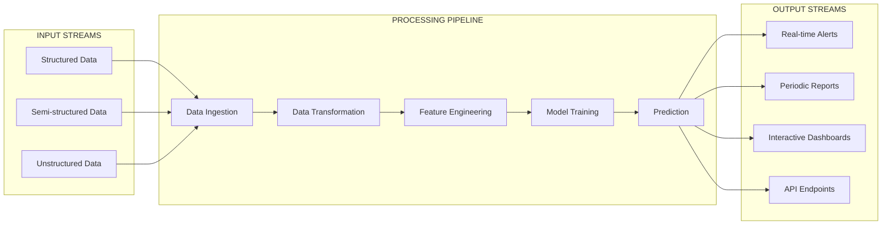
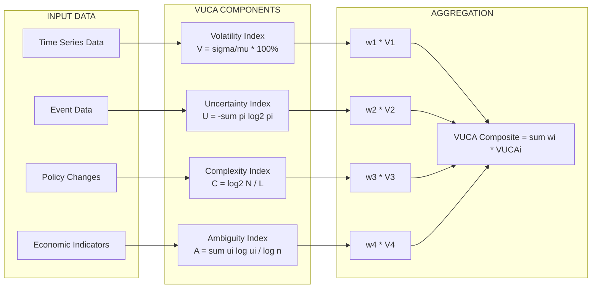
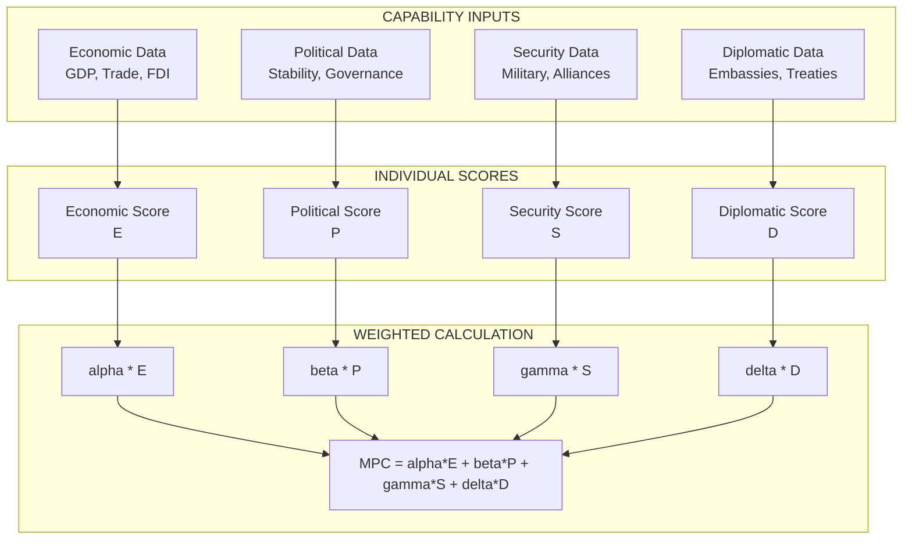
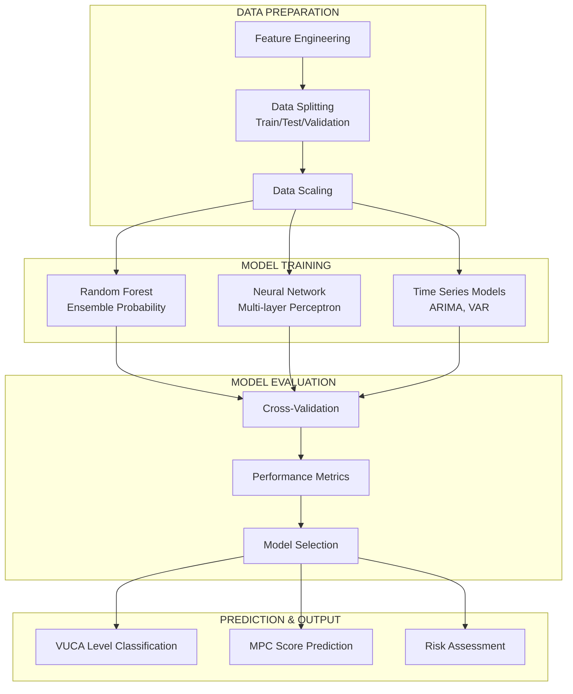
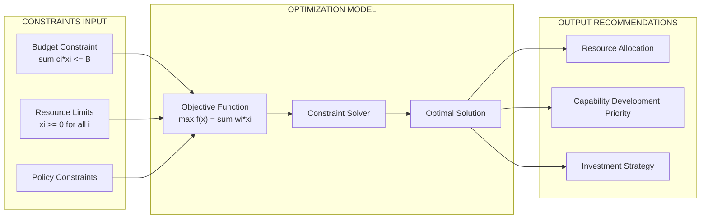
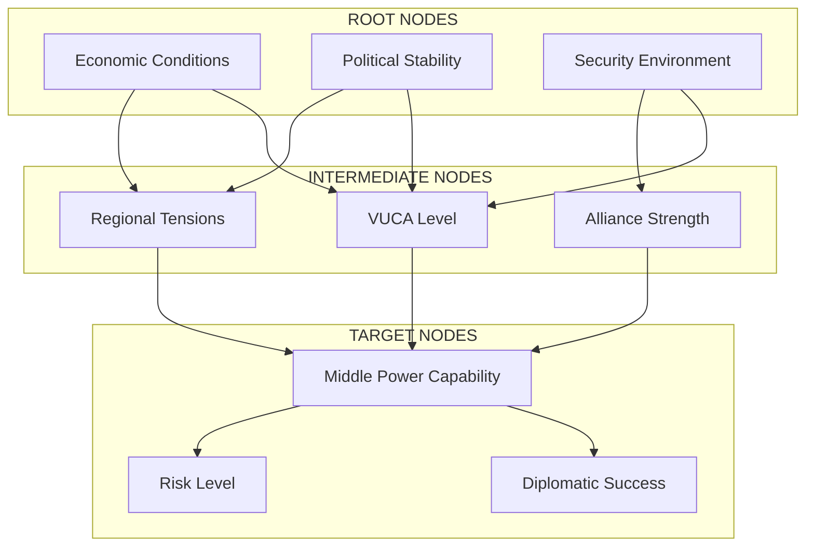
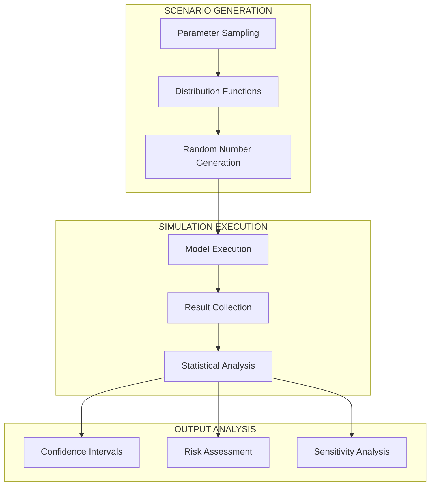
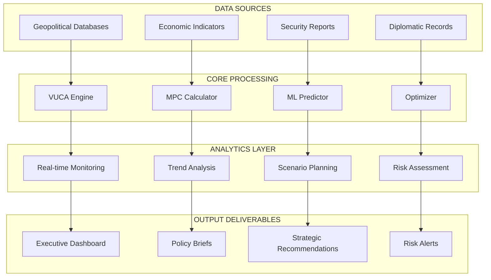

# SOLUTION.md
## Comprehensive Solution for VUCA and Middle Power Capabilities Analysis System

### Table of Contents
1. [System Overview](#1-system-overview)
2. [Mathematical Framework](#2-mathematical-framework)
3. [System Architecture](#3-system-architecture)
4. [Implementation Workflow](#4-implementation-workflow)
5. [Machine Learning Models](#5-machine-learning-models)
6. [Optimization Engine](#6-optimization-engine)
7. [Risk Assessment & Analytics](#7-risk-assessment--analytics)
8. [Performance Metrics](#8-performance-metrics)
9. [Implementation Guidelines](#9-implementation-guidelines)
10. [Technical Requirements](#10-technical-requirements)

---

## 1. System Overview

### 1.1 Integrated VUCA-MPC System

The system integrates two core analytical frameworks:

- **VUCA Analysis**: Volatility, Uncertainty, Complexity, and Ambiguity assessment
- **Middle Power Capabilities (MPC)**: Economic, Political, Security, and Diplomatic capability scoring

### 1.2 System State Vector

The complete system state is represented by:

$$\mathbf{X}_t = \begin{bmatrix} V_t \\ U_t \\ C_t \\ A_t \\ E_t \\ P_t \\ S_t \\ D_t \end{bmatrix}$$

Where:
- $V_t, U_t, C_t, A_t$ = VUCA components at time $t$
- $E_t, P_t, S_t, D_t$ = MPC components at time $t$

### 1.3 Performance Objective Function

$$J = \int_{0}^{T} [\mathbf{X}^T(t) \mathbf{Q} \mathbf{X}(t) + \mathbf{u}^T(t) \mathbf{R} \mathbf{u}(t)] dt$$

Where:
- $\mathbf{Q}$ = State cost matrix
- $\mathbf{R}$ = Control cost matrix
- $T$ = Time horizon

---

## 2. Mathematical Framework

### 2.1 VUCA Index Mathematical Framework

#### 2.1.1 Volatility Index (V)

$$V = \frac{\sigma}{\mu} \times 100\%$$

Where:
- $\sigma$ = Standard deviation of the time series
- $\mu$ = Mean of the time series

**Implementation:**
```python
def calculate_volatility_index(time_series):
    mean = np.mean(time_series)
    std = np.std(time_series)
    volatility_index = (std / mean) * 100 if mean != 0 else 0
    return volatility_index
```

#### 2.1.2 Uncertainty Index (U)

$$U = -\sum_{i=1}^{n} p_i \log_2(p_i)$$

Where:
- $p_i$ = Probability of event $i$ occurring
- $\log_2$ = Binary logarithm
- $n$ = Number of possible events

**Implementation:**
```python
def calculate_uncertainty_index(probabilities):
    uncertainty = 0
    for p in probabilities:
        if p > 0:
            uncertainty -= p * np.log2(p)
    return uncertainty
```

#### 2.1.3 Complexity Index (C)

$$C = \frac{\log_2(N)}{L}$$

Where:
- $N$ = Number of distinct elements or states
- $L$ = Average length of patterns or sequences

**Implementation:**
```python
def calculate_complexity_index(elements, pattern_lengths):
    N = len(set(elements))
    L = np.mean(pattern_lengths) if pattern_lengths else 1
    complexity_index = np.log2(N) / L if L > 0 else 0
    return complexity_index
```

#### 2.1.4 Ambiguity Index (A)

$$A = \frac{\sum_{i=1}^{n} u_i \log(u_i)}{\log(n)}$$

Where:
- $u_i$ = Uncertainty level for factor $i$
- $n$ = Number of factors considered

**Implementation:**
```python
def calculate_ambiguity_index(uncertainty_levels):
    n = len(uncertainty_levels)
    if n <= 1:
        return 0
    
    ambiguity = 0
    for ui in uncertainty_levels:
        if ui > 0:
            ambiguity += ui * np.log(ui)
    
    ambiguity_index = ambiguity / np.log(n)
    return ambiguity_index
```

#### 2.1.5 VUCA Composite Index

$$VUCA_{composite} = \sum_{i=1}^{4} w_i \cdot VUCA_i$$

Where:
- $w_i$ = Weight for component $i$ ($\sum_{i=1}^{4} w_i = 1$)
- $VUCA_i$ = Normalized value of component $i$

**Default Weights:**
$$\mathbf{w} = [0.25, 0.25, 0.25, 0.25]^T$$

### 2.2 Middle Power Capability (MPC) Mathematical Framework

#### 2.2.1 Economic Capability Score (E)

$$E = \frac{\sum_{i=1}^{k} \alpha_i \cdot E_i}{\sum_{i=1}^{k} \alpha_i}$$

Where:
- $\alpha_i$ = Weight for economic indicator $i$
- $E_i$ = Normalized value of economic indicator $i$

**Economic Indicators:**
- GDP per capita
- Trade volume
- Foreign Direct Investment (FDI)
- Economic growth rate

#### 2.2.2 Political Capability Score (P)

$$P = \frac{\sum_{i=1}^{k} \beta_i \cdot P_i}{\sum_{i=1}^{k} \beta_i}$$

**Political Indicators:**
- Political stability index
- Rule of law index
- Corruption perception index
- Democracy index

#### 2.2.3 Security Capability Score (S)

$$S = \frac{\sum_{i=1}^{k} \gamma_i \cdot S_i}{\sum_{i=1}^{k} \gamma_i}$$

**Security Indicators:**
- Military spending
- Alliance strength
- Border security index
- Cybersecurity index

#### 2.2.4 Diplomatic Capability Score (D)

$$D = \frac{\sum_{i=1}^{k} \delta_i \cdot D_i}{\sum_{i=1}^{k} \delta_i}$$

**Diplomatic Indicators:**
- Number of embassies
- Treaty participation
- International organization membership
- Diplomatic network quality

#### 2.2.5 MPC Composite Score

$$MPC = \alpha \cdot E + \beta \cdot P + \gamma \cdot S + \delta \cdot D$$

**Default Weights:**
$$\mathbf{w}_{MPC} = [0.30, 0.25, 0.25, 0.20]^T$$

---

## 3. System Architecture

### 3.1 Overview Sistem



### 3.2 Data Flow Architecture



---

## 4. Implementation Workflow

### 4.1 Workflow Penelitian Lengkap


### 4.2 Proses Perhitungan VUCA Index



### 4.3 Proses Perhitungan Middle Power Capability Index



---

## 5. Machine Learning Models

### 5.1 Machine Learning Pipeline



### 5.2 Random Forest for VUCA Classification

**Model:** Random Forest Classifier

**Mathematical Foundation:**

$$\hat{y} = \text{mode}\{h_1(x), h_2(x), \ldots, h_T(x)\}$$

**Ensemble Probability:**

$$P(y = c|x) = \frac{1}{T}\sum_{t=1}^{T} \mathbb{I}[h_t(x) = c]$$

**Implementation:**
```python
def train_vuca_classifier(X_train, y_train, hyperparameters=None):
    from sklearn.ensemble import RandomForestClassifier
    
    if hyperparameters is None:
        hyperparameters = {
            'n_estimators': 100,
            'max_depth': None,
            'min_samples_split': 2,
            'min_samples_leaf': 1,
            'random_state': 42
        }
    
    rf_classifier = RandomForestClassifier(**hyperparameters)
    rf_classifier.fit(X_train, y_train)
    
    return rf_classifier
```

### 5.3 Neural Network for MPC Prediction

**Model:** Multi-layer Perceptron (MLP)

**Mathematical Foundation:**

$$f(x) = W_L \cdot \sigma(W_{L-1} \cdot \sigma(\ldots \sigma(W_1 \cdot x + b_1) \ldots) + b_{L-1}) + b_L$$

**Implementation:**
```python
def build_mpc_neural_network(input_dim, hidden_layers=[64, 32, 16]):
    from tensorflow.keras.models import Sequential
    from tensorflow.keras.layers import Dense, Dropout
    
    model = Sequential()
    
    # Input layer
    model.add(Dense(hidden_layers[0], input_dim=input_dim, activation='relu'))
    model.add(Dropout(0.2))
    
    # Hidden layers
    for units in hidden_layers[1:]:
        model.add(Dense(units, activation='relu'))
        model.add(Dropout(0.2))
    
    # Output layer
    model.add(Dense(1, activation='linear'))
    
    model.compile(optimizer='adam', loss='mse', metrics=['mae'])
    return model
```

### 5.4 Time Series Models

#### 5.4.1 ARIMA Model

**Formula:** ARIMA(p,d,q)

**Mathematical Formulation:**

$$\phi(B)(1-B)^d X_t = \theta(B) \epsilon_t$$

**Implementation:**
```python
def fit_arima_model(time_series, order=(1,1,1)):
    from statsmodels.tsa.arima.model import ARIMA
    
    model = ARIMA(time_series, order=order)
    fitted_model = model.fit()
    
    return fitted_model
```

#### 5.4.2 VAR Model

**Formula:** VAR(p)

**Mathematical Formulation:**

$$\mathbf{X}_t = \mathbf{c} + \sum_{i=1}^{p} \mathbf{A}_i \mathbf{X}_{t-i} + \boldsymbol{\epsilon}_t$$

**Implementation:**
```python
def fit_var_model(time_series, maxlags=5):
    from statsmodels.tsa.vector_ar.var_model import VAR
    
    model = VAR(time_series)
    results = model.select_order(maxlags)
    fitted_model = model.fit(maxlags=results.aic)
    
    return fitted_model
```

---

## 6. Optimization Engine

### 6.1 Linear Programming Model

**Mathematical Formulation:**

$$\max_{\mathbf{x}} \quad f(\mathbf{x}) = \mathbf{w}^T \mathbf{x}$$

**Subject to:**

$$\mathbf{A} \mathbf{x} \leq \mathbf{b}$$

$$\mathbf{x} \geq \mathbf{0}$$

**Implementation:**
```python
def optimize_resource_allocation(objective_weights, costs, budget, constraints_matrix, constraints_rhs):
    from scipy.optimize import linprog
    
    # Minimize negative objective (equivalent to maximizing)
    objective = [-w for w in objective_weights]
    
    # Solve linear programming problem
    result = linprog(
        c=objective,
        A_ub=constraints_matrix,
        b_ub=constraints_rhs,
        bounds=[(0, None)] * len(objective_weights),
        method='highs'
    )
    
    return result
```

### 6.2 Optimization Engine Process



---

## 7. Risk Assessment & Analytics

### 7.1 Bayesian Network Structure



### 7.2 Monte Carlo Simulation Process



### 7.3 Value at Risk (VaR)

**Mathematical Definition:**

$$VaR(\alpha) = F^{-1}(\alpha)$$

**Parametric VaR (Normal Distribution):**
$$VaR(\alpha) = \mu + \sigma \cdot \Phi^{-1}(\alpha)$$

**Implementation:**
```python
def calculate_var(data, confidence_level=0.05):
    import numpy as np
    var = np.percentile(data, confidence_level * 100)
    return var
```

### 7.4 Expected Shortfall (ES)

**Mathematical Definition:**
$$ES(\alpha) = E[X|X \leq VaR(\alpha)]$$

**Empirical ES:**
$$ES(\alpha) = \frac{1}{n\alpha} \sum_{i=1}^{n} x_i \cdot \mathbb{I}[x_i \leq VaR(\alpha)]$$

---

## 8. Performance Metrics

### 8.1 Classification Metrics

**Confusion Matrix:**
$$\mathbf{C} = \begin{bmatrix} TP & FP \\ FN & TN \end{bmatrix}$$

**Accuracy:**
$$Acc = \frac{TP + TN}{TP + TN + FP + FN}$$

**F1-Score:**
$$F1 = 2 \cdot \frac{Prec \cdot Rec}{Prec + Rec}$$

**Implementation:**
```python
def calculate_classification_metrics(y_true, y_pred):
    from sklearn.metrics import accuracy_score, precision_score, recall_score, f1_score
    
    metrics = {
        'accuracy': accuracy_score(y_true, y_pred),
        'precision': precision_score(y_true, y_pred, average='weighted'),
        'recall': recall_score(y_true, y_pred, average='weighted'),
        'f1_score': f1_score(y_true, y_pred, average='weighted')
    }
    
    return metrics
```

### 8.2 Regression Metrics

**Mean Squared Error (MSE):**
$$MSE = \frac{1}{n}\sum_{i=1}^{n}(y_i - \hat{y}_i)^2$$

**R² Score:**
$$R^2 = 1 - \frac{\sum_{i=1}^{n}(y_i - \hat{y}_i)^2}{\sum_{i=1}^{n}(y_i - \bar{y})^2}$$

**Implementation:**
```python
def calculate_regression_metrics(y_true, y_pred):
    from sklearn.metrics import mean_squared_error, mean_absolute_error, r2_score
    import numpy as np
    
    mse = mean_squared_error(y_true, y_pred)
    rmse = np.sqrt(mse)
    mae = mean_absolute_error(y_true, y_pred)
    r2 = r2_score(y_true, y_pred)
    
    metrics = {
        'mse': mse,
        'rmse': rmse,
        'mae': mae,
        'r2': r2
    }
    
    return metrics
```

### 8.3 Cross-Validation

**K-Fold Cross-Validation:**
$$CV_{score} = \frac{1}{k}\sum_{i=1}^{k} Score_i$$

**Implementation:**
```python
def perform_cross_validation(model, X, y, cv=5, scoring='accuracy'):
    from sklearn.model_selection import cross_val_score
    
    cv_scores = cross_val_score(model, X, y, cv=cv, scoring=scoring)
    
    return {
        'scores': cv_scores,
        'mean': cv_scores.mean(),
        'std': cv_scores.std()
    }
```

---

## 9. Implementation Guidelines

### 9.1 Data Requirements
- **Minimum Data**: 5 years of historical data for time series analysis
- **Sample Size**: At least 1000 samples for machine learning models
- **Data Quality**: Score > 0.8 for reliable results

### 9.2 Model Validation
- **Data Split**: 70% training, 15% validation, 15% testing
- **Cross-Validation**: k=5 or k=10 folds
- **Testing**: Out-of-sample data validation

### 9.3 Performance Thresholds
- **Classification**: Accuracy > 0.75
- **Regression**: R² > 0.6
- **Forecasting**: MAPE < 20%

### 9.4 Update Frequency
- **VUCA Index**: Daily updates
- **MPC Score**: Weekly updates
- **Model Retraining**: Monthly
- **System Review**: Quarterly

### 9.5 Mathematical Validation
- Verify all mathematical constraints are satisfied
- Ensure numerical stability in computations
- Perform sensitivity analysis on key parameters
- Validate against theoretical bounds

---

## 10. Technical Requirements

### 10.1 Technology Stack

**Data Processing:**
- Python, Pandas, NumPy
- Data validation and cleaning tools

**Machine Learning:**
- Scikit-learn, TensorFlow, PyTorch
- Model training and evaluation frameworks

**Visualization:**
- Matplotlib, Plotly, Tableau
- Interactive dashboards and reporting

**Database:**
- PostgreSQL, MongoDB
- Time series and document storage

**API & Deployment:**
- FastAPI, Flask
- Docker, Kubernetes

### 10.2 System Integration

**Complete System Integration:**


### 10.3 Monitoring and Maintenance

**Real-time Monitoring:**
- Dashboard untuk monitoring performa model
- Automated testing dan validation pipeline
- Performance metrics tracking
- Alert system untuk anomaly detection

**Maintenance Schedule:**
- Regular model retraining dan update
- Performance review dan optimization
- System health monitoring
- Backup dan recovery procedures

---

## Mathematical Summary and Integration

### **Complete System Mathematical Framework**

**Integrated VUCA-MPC System:**
$$\mathbf{S} = \begin{bmatrix} VUCA_{composite} \\ MPC_{score} \end{bmatrix} = \begin{bmatrix} \sum_{i=1}^{4} w_i \cdot VUCA_i \\ \alpha \cdot E + \beta \cdot P + \gamma \cdot S + \delta \cdot D \end{bmatrix}$$

**State Transition Equation:**
$$\mathbf{X}_{t+1} = \mathbf{A} \mathbf{X}_t + \mathbf{B} \mathbf{u}_t + \boldsymbol{\epsilon}_t$$

**Statistical Inference Framework:**
$$P(\boldsymbol{\theta}|\mathbf{D}) \propto P(\mathbf{D}|\boldsymbol{\theta}) \cdot P(\boldsymbol{\theta})$$

**Uncertainty Quantification:**
$$U_{total} = U_{aleatory} + U_{epistemic}$$

---

## References and Further Reading

### **Mathematical Foundations**
- **Linear Algebra**: Strang, G. (2006). Linear Algebra and Its Applications
- **Optimization**: Boyd, S. & Vandenberghe, L. (2004). Convex Optimization
- **Time Series**: Hamilton, J.D. (1994). Time Series Analysis
- **Machine Learning**: Bishop, C.M. (2006). Pattern Recognition and Machine Learning

### **Statistical Methods**
- **Bayesian Statistics**: Gelman, A. et al. (2013). Bayesian Data Analysis
- **Risk Management**: McNeil, A.J. et al. (2015). Quantitative Risk Management
- **Forecasting**: Hyndman, R.J. & Athanasopoulos, G. (2018). Forecasting: Principles and Practice

---

*This comprehensive SOLUTION.md document provides the complete integration of design architecture and mathematical models for implementing the VUCA and Middle Power Capabilities analysis system. It includes all necessary mathematical formulations, system architecture diagrams, implementation guidelines, and technical requirements for successful deployment.*
