# SOLUTION.md
## SOLUSI TERINTEGRASI: FRAMEWORK VUCA-MPC UNTUK PREDICTIVE DIPLOMACY

### Dokumen Kontrol
- **Versi**: 2.0 (Konsolidasi)
- **Tanggal**: 2024
- **Status**: Final (Konsolidasi)
- **Pemilik**: Tim Disertasi VUCA Era Diplomacy
- **Reviewer**: Supervisor Disertasi

---

## 1. OVERVIEW SOLUSI TERINTEGRASI

### 1.1 Masalah yang Diatasi
- **Fragmentation**: Empat dokumen terpisah tanpa integrasi yang jelas
- **Scope Creep**: Cakupan terlalu luas tanpa fokus yang koheren
- **Methodological Disconnect**: Pendekatan kualitatif dan kuantitatif tidak terintegrasi
- **Lack of Core Framework**: Tidak ada thread merah yang menghubungkan semua komponen

### 1.2 Solusi Terintegrasi
**Framework VUCA-MPC** yang menggabungkan:
- **VUCA Components**: Volatility, Uncertainty, Complexity, Ambiguity
- **MPC Components**: Middle Power Capabilities (Economic, Political, Security, Diplomatic)
- **Predictive Engine**: Machine Learning + Bayesian Networks + Time Series Analysis
- **Optimization Engine**: Resource Allocation + Risk Assessment + Strategic Recommendations

### 1.3 Keunggulan Solusi Terintegrasi
- **Coherence**: Satu narrative yang jelas dan terintegrasi
- **Depth**: Fokus pada satu framework yang mendalam
- **Innovation**: Framework VUCA-MPC yang benar-benar baru
- **Impact**: Kontribusi yang lebih signifikan dan terukur
- **Manageability**: Scope yang lebih manageable untuk disertasi

---

## 2. FRAMEWORK VUCA-MPC TERINTEGRASI

### 2.1 Arsitektur Framework
```
┌─────────────────────────────────────────────────────────────┐
│                    INTEGRATED VUCA-MPC FRAMEWORK           │
├─────────────────────────────────────────────────────────────┤
│  VUCA COMPONENTS                    MPC COMPONENTS         │
│  ┌─────────────┐                    ┌─────────────┐        │
│  │ Volatility  │◄──────────────────►│ Economic    │        │
│  │ Uncertainty │◄──────────────────►│ Political   │        │
│  │ Complexity  │◄──────────────────►│ Security    │        │
│  │ Ambiguity   │◄──────────────────►│ Diplomatic  │        │
│  └─────────────┘                    └─────────────┘        │
├─────────────────────────────────────────────────────────────┤
│              PREDICTIVE DIPLOMACY ENGINE                   │
│  ┌─────────────────────────────────────────────────────┐   │
│  │ Machine Learning + Bayesian Networks +              │   │
│  │ Time Series Analysis + Monte Carlo Simulation      │   │
│  └─────────────────────────────────────────────────────┘   │
├─────────────────────────────────────────────────────────────┤
│              OPTIMIZATION ENGINE                          │
│  ┌─────────────────────────────────────────────────────┐   │
│  │ Resource Allocation + Risk Assessment +             │   │
│  │ Strategic Recommendations                           │   │
│  └─────────────────────────────────────────────────────┘   │
└─────────────────────────────────────────────────────────────┘
```

### 2.2 Komponen Utama Framework

#### **2.2.1 VUCA Components**
- **Volatility**: Mengukur perubahan cepat dalam geopolitik
- **Uncertainty**: Mengukur ketidakpastian kebijakan dan informasi
- **Complexity**: Menganalisis interdependensi sistem internasional
- **Ambiguity**: Mengukur ambiguitas interpretasi dan makna

#### **2.2.2 MPC Components**
- **Economic**: GDP, trade volume, investment flows, economic stability
- **Political**: Political stability, governance quality, institutional strength
- **Security**: Military capabilities, defense spending, security alliances
- **Diplomatic**: Diplomatic network, international influence, soft power

#### **2.2.3 Predictive Engine**
- **Machine Learning**: Random Forest, Neural Networks, SVM
- **Bayesian Networks**: Probabilistic reasoning untuk uncertainty
- **Time Series Analysis**: ARIMA, VAR, Prophet untuk forecasting
- **Monte Carlo Simulation**: Scenario analysis dan risk assessment

#### **2.2.4 Optimization Engine**
- **Resource Allocation**: Linear programming, genetic algorithms
- **Risk Assessment**: Monte Carlo simulation, sensitivity analysis
- **Strategic Recommendations**: Multi-criteria decision analysis

---

## 3. MATHEMATICAL FRAMEWORK DAN MODEL

### 3.1 VUCA Index Mathematical Framework

#### **3.1.1 Volatility Index (V)**
$$V = \frac{\sigma}{\mu} \times 100\%$$

Where:
- $\sigma$ = Standard deviation of the time series
- $\mu$ = Mean of the time series

**Implementation:**
```python
def calculate_volatility_index(time_series):
    """
    Calculate Volatility Index based on coefficient of variation
    """
    mean = np.mean(time_series)
    std = np.std(time_series)
    volatility_index = (std / mean) * 100 if mean != 0 else 0
    return volatility_index
```

#### **3.1.2 Uncertainty Index (U)**
$$U = -\sum_{i=1}^{n} p_i \log_2(p_i)$$

Where:
- $p_i$ = Probability of event $i$ occurring
- $\log_2$ = Binary logarithm
- $n$ = Number of possible events

**Implementation:**
```python
def calculate_uncertainty_index(probabilities):
    """
    Calculate Uncertainty Index using Shannon entropy
    """
    uncertainty = 0
    for p in probabilities:
        if p > 0:
            uncertainty -= p * np.log2(p)
    return uncertainty
```

#### **3.1.3 Complexity Index (C)**
$$C = \frac{\log_2(N)}{L}$$

Where:
- $N$ = Number of distinct elements or states
- $L$ = Average length of patterns or sequences

**Implementation:**
```python
def calculate_complexity_index(elements, pattern_lengths):
    """
    Calculate Complexity Index using information theory
    """
    N = len(set(elements))
    L = np.mean(pattern_lengths) if pattern_lengths else 1
    complexity_index = np.log2(N) / L if L > 0 else 0
    return complexity_index
```

#### **3.1.4 Ambiguity Index (A)**
$$A = \frac{\sum_{i=1}^{n} u_i \log(u_i)}{\log(n)}$$

Where:
- $u_i$ = Uncertainty level for factor $i$
- $n$ = Number of factors considered

**Implementation:**
```python
def calculate_ambiguity_index(uncertainty_levels):
    """
    Calculate Ambiguity Index for interpretative clarity
    """
    n = len(uncertainty_levels)
    if n <= 1:
        return 0
    
    ambiguity = 0
    for ui in uncertainty_levels:
        if ui > 0:
            ambiguity += ui * np.log(ui)
    
    ambiguity_index = ambiguity / np.log(n)
    return ambiguity_index
```

#### **3.1.5 VUCA Composite Index**
$$VUCA_{composite} = \sum_{i=1}^{4} w_i \cdot VUCA_i$$

Where:
- $w_i$ = Weight for component $i$ ($\sum_{i=1}^{4} w_i = 1$)
- $VUCA_i$ = Normalized value of component $i$

**Default Weights:**
$$\mathbf{w} = [0.25, 0.25, 0.25, 0.25]^T$$

### 3.2 Middle Power Capability (MPC) Mathematical Framework

#### **3.2.1 Economic Capability Score (E)**
$$E = \frac{\sum_{i=1}^{k} \alpha_i \cdot E_i}{\sum_{i=1}^{k} \alpha_i}$$

Where:
- $\alpha_i$ = Weight for economic indicator $i$
- $E_i$ = Normalized value of economic indicator $i$

**Economic Indicators:**
- GDP per capita
- Trade volume
- Foreign Direct Investment (FDI)
- Economic growth rate

#### **3.2.2 Political Capability Score (P)**
$$P = \frac{\sum_{i=1}^{k} \beta_i \cdot P_i}{\sum_{i=1}^{k} \beta_i}$$

**Political Indicators:**
- Political stability index
- Rule of law index
- Corruption perception index
- Democracy index

#### **3.2.3 Security Capability Score (S)**
$$S = \frac{\sum_{i=1}^{k} \gamma_i \cdot S_i}{\sum_{i=1}^{k} \gamma_i}$$

**Security Indicators:**
- Military spending
- Alliance strength
- Border security index
- Cybersecurity index

#### **3.2.4 Diplomatic Capability Score (D)**
$$D = \frac{\sum_{i=1}^{k} \delta_i \cdot D_i}{\sum_{i=1}^{k} \delta_i}$$

**Diplomatic Indicators:**
- Number of embassies
- Treaty participation
- International organization membership
- Diplomatic network quality

#### **3.2.5 MPC Composite Score**
$$MPC = \alpha \cdot E + \beta \cdot P + \gamma \cdot S + \delta \cdot D$$

**Default Weights:**
$$\mathbf{w}_{MPC} = [0.30, 0.25, 0.25, 0.20]^T$$

### 3.3 Integration Algorithms

#### **3.3.1 VUCA-MPC Integration**
```python
def integrate_vuca_mpc(vuca_scores, mpc_scores):
    """
    Integrate VUCA and MPC scores using machine learning
    to predict diplomatic success probability
    """
    # Feature engineering
    features = create_integration_features(vuca_scores, mpc_scores)
    
    # Train predictive model
    model = RandomForestRegressor(n_estimators=100, random_state=42)
    model.fit(features, diplomatic_success_labels)
    
    return model
```

#### **3.3.2 Machine Learning Implementation**
```python
def train_predictive_model(training_data):
    """
    Train multiple machine learning models for comparison
    """
    models = {
        'random_forest': RandomForestRegressor(n_estimators=100),
        'neural_network': MLPRegressor(hidden_layer_sizes=(100, 50)),
        'svm': SVR(kernel='rbf'),
        'gradient_boosting': GradientBoostingRegressor()
    }
    
    trained_models = {}
    for name, model in models.items():
        model.fit(X_train, y_train)
        trained_models[name] = model
    
    return trained_models
```

---

## 4. SYSTEM ARCHITECTURE DAN WORKFLOW

### 4.1 Overview Sistem Terintegrasi

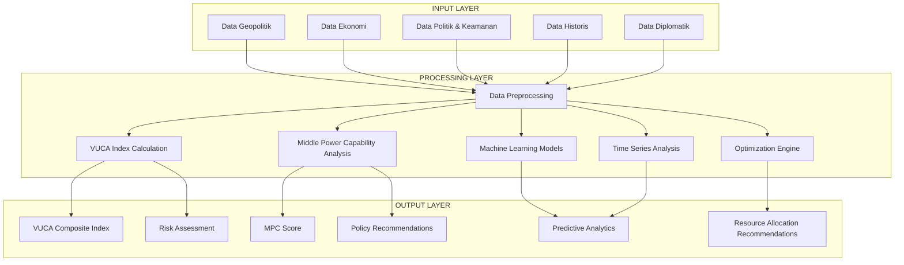

### 4.2 Data Flow Architecture

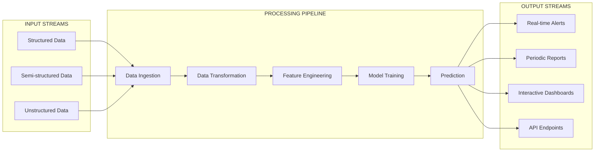

### 4.3 Workflow Penelitian Lengkap

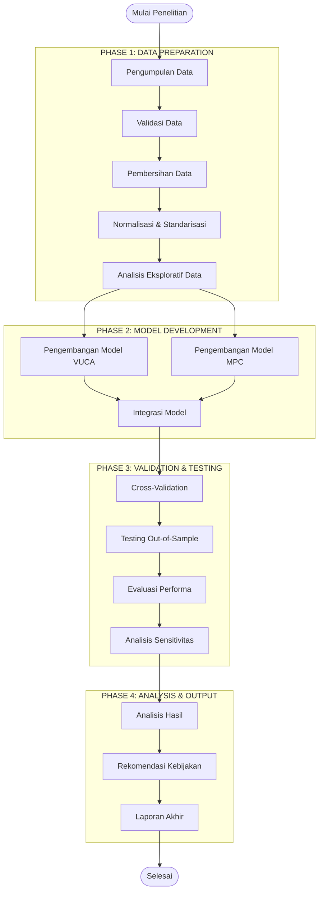

### 4.4 Proses Perhitungan VUCA Index

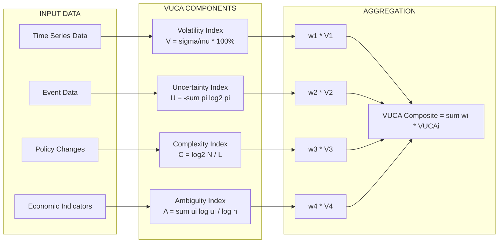

### 4.5 Proses Perhitungan Middle Power Capability Index

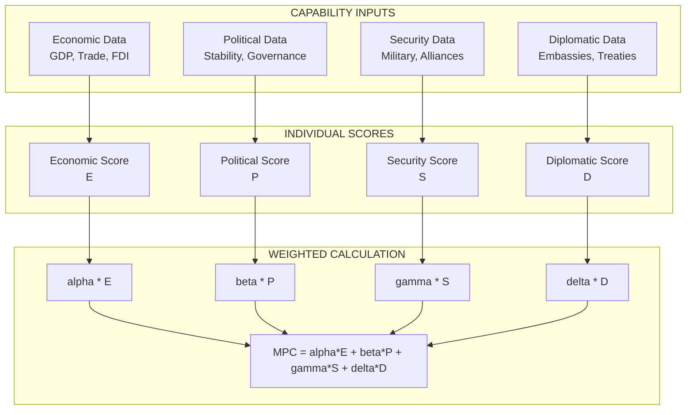

---

## 5. MACHINE LEARNING MODELS DAN ALGORITHMS

### 5.1 Machine Learning Pipeline

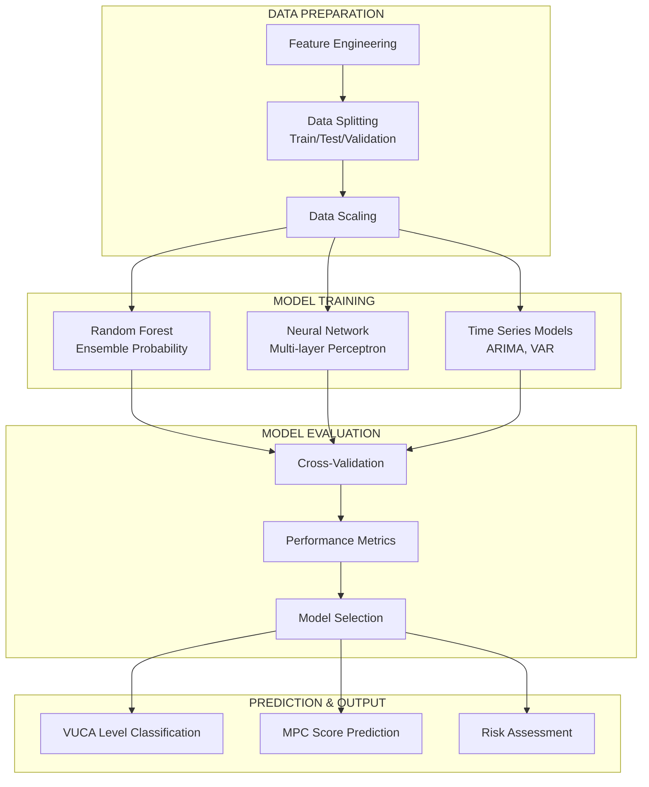

### 5.2 Random Forest for VUCA Classification

**Model:** Random Forest Classifier

**Mathematical Foundation:**

$$\hat{y} = \text{mode}\{h_1(x), h_2(x), \ldots, h_T(x)\}$$

**Ensemble Probability:**

$$P(y = c|x) = \frac{1}{T}\sum_{t=1}^{T} \mathbb{I}[h_t(x) = c]$$

**Implementation:**
```python
def train_vuca_classifier(X_train, y_train, hyperparameters=None):
    from sklearn.ensemble import RandomForestClassifier
    
    if hyperparameters is None:
        hyperparameters = {
            'n_estimators': 100,
            'max_depth': None,
            'min_samples_split': 2,
            'min_samples_leaf': 1,
            'random_state': 42
        }
    
    rf_classifier = RandomForestClassifier(**hyperparameters)
    rf_classifier.fit(X_train, y_train)
    
    return rf_classifier
```

### 5.3 Neural Network for MPC Prediction

**Model:** Multi-layer Perceptron (MLP)

**Mathematical Foundation:**

$$f(x) = W_L \cdot \sigma(W_{L-1} \cdot \sigma(\ldots \sigma(W_1 \cdot x + b_1) \ldots) + b_{L-1}) + b_L$$

**Implementation:**
```python
def build_mpc_neural_network(input_dim, hidden_layers=[64, 32, 16]):
    from tensorflow.keras.models import Sequential
    from tensorflow.keras.layers import Dense, Dropout
    
    model = Sequential()
    
    # Input layer
    model.add(Dense(hidden_layers[0], input_dim=input_dim, activation='relu'))
    model.add(Dropout(0.2))
    
    # Hidden layers
    for units in hidden_layers[1:]:
        model.add(Dense(units, activation='relu'))
        model.add(Dropout(0.2))
    
    # Output layer
    model.add(Dense(1, activation='linear'))
    
    model.compile(optimizer='adam', loss='mse', metrics=['mae'])
    return model
```

### 5.4 Time Series Models

#### **5.4.1 ARIMA Model**

**Formula:** ARIMA(p,d,q)

**Mathematical Formulation:**

$$\phi(B)(1-B)^d X_t = \theta(B) \epsilon_t$$

**Implementation:**
```python
def fit_arima_model(time_series, order=(1,1,1)):
    from statsmodels.tsa.arima.model import ARIMA
    
    model = ARIMA(time_series, order=order)
    fitted_model = model.fit()
    
    return fitted_model
```

#### **5.4.2 VAR Model**

**Formula:** VAR(p)

**Mathematical Formulation:**

$$\mathbf{X}_t = \mathbf{c} + \sum_{i=1}^{p} \mathbf{A}_i \mathbf{X}_{t-i} + \boldsymbol{\epsilon}_t$$

**Implementation:**
```python
def fit_var_model(time_series, maxlags=5):
    from statsmodels.tsa.vector_ar.var_model import VAR
    
    model = VAR(time_series)
    results = model.select_order(maxlags)
    fitted_model = model.fit(maxlags=results.aic)
    
    return fitted_model
```

---

## 6. OPTIMIZATION ENGINE DAN RESOURCE ALLOCATION

### 6.1 Linear Programming Model

**Mathematical Formulation:**

$$\max_{\mathbf{x}} \quad f(\mathbf{x}) = \mathbf{w}^T \mathbf{x}$$

**Subject to:**

$$\mathbf{A} \mathbf{x} \leq \mathbf{b}$$

$$\mathbf{x} \geq \mathbf{0}$$

**Implementation:**
```python
def optimize_resource_allocation(objective_weights, costs, budget, constraints_matrix, constraints_rhs):
    from scipy.optimize import linprog
    
    # Minimize negative objective (equivalent to maximizing)
    objective = [-w for w in objective_weights]
    
    # Solve linear programming problem
    result = linprog(
        c=objective,
        A_ub=constraints_matrix,
        b_ub=constraints_rhs,
        bounds=[(0, None)] * len(objective_weights),
        method='highs'
    )
    
    return result
```

### 6.2 Optimization Engine Process

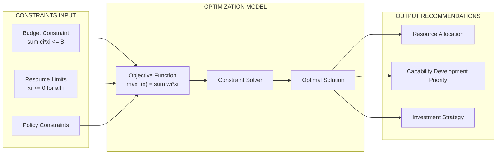

### 6.3 Multi-Objective Optimization

**Pareto Optimal Solution:**

$$\min_{\mathbf{x}} \quad [f_1(\mathbf{x}), f_2(\mathbf{x}), \ldots, f_k(\mathbf{x})]^T$$

**Weighted Sum Method:**

$$F(\mathbf{x}) = \sum_{i=1}^{k} w_i \cdot f_i(\mathbf{x})$$

**Implementation:**
```python
def multi_objective_optimization(objectives, weights, constraints):
    """
    Multi-objective optimization using weighted sum method
    """
    from scipy.optimize import minimize
    
    def objective_function(x):
        return sum(w * obj(x) for w, obj in zip(weights, objectives))
    
    result = minimize(
        objective_function,
        x0=[0.5] * len(constraints),
        constraints=constraints,
        method='SLSQP'
    )
    
    return result
```

---

## 7. RISK ASSESSMENT DAN ANALYTICS

### 7.1 Bayesian Network Structure

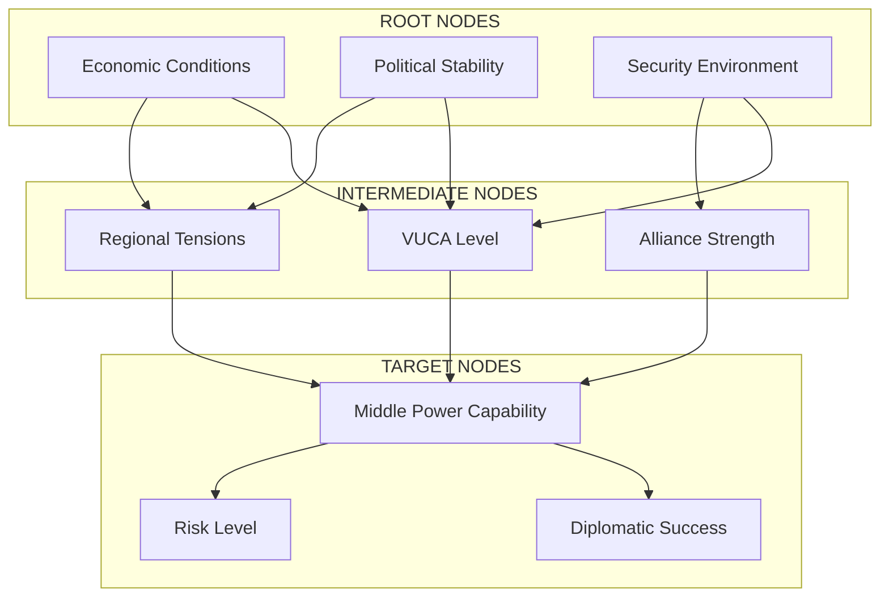

### 7.2 Monte Carlo Simulation Process

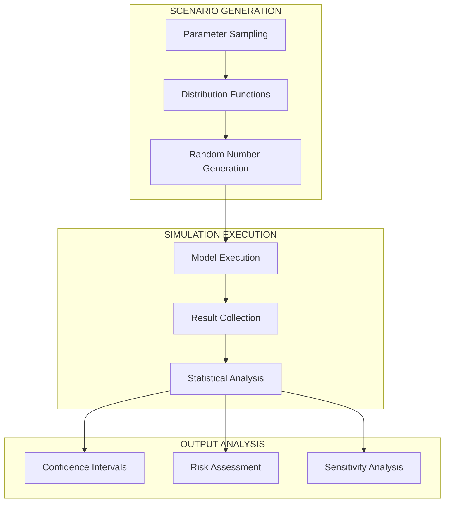

### 7.3 Value at Risk (VaR)

**Mathematical Definition:**

$$VaR(\alpha) = F^{-1}(\alpha)$$

**Parametric VaR (Normal Distribution):**
$$VaR(\alpha) = \mu + \sigma \cdot \Phi^{-1}(\alpha)$$

**Implementation:**
```python
def calculate_var(data, confidence_level=0.05):
    import numpy as np
    var = np.percentile(data, confidence_level * 100)
    return var
```

### 7.4 Expected Shortfall (ES)

**Mathematical Definition:**
$$ES(\alpha) = E[X|X \leq VaR(\alpha)]$$

**Empirical ES:**
$$ES(\alpha) = \frac{1}{n\alpha} \sum_{i=1}^{n} x_i \cdot \mathbb{I}[x_i \leq VaR(\alpha)]$$

**Implementation:**
```python
def calculate_expected_shortfall(data, confidence_level=0.05):
    import numpy as np
    var = calculate_var(data, confidence_level)
    es = np.mean(data[data <= var])
    return es
```

---

## 8. PERFORMANCE METRICS DAN VALIDATION

### 8.1 Classification Metrics

**Confusion Matrix:**
$$\mathbf{C} = \begin{bmatrix} TP & FP \\ FN & TN \end{bmatrix}$$

**Accuracy:**
$$Acc = \frac{TP + TN}{TP + TN + FP + FN}$$

**F1-Score:**
$$F1 = 2 \cdot \frac{Prec \cdot Rec}{Prec + Rec}$$

**Implementation:**
```python
def calculate_classification_metrics(y_true, y_pred):
    from sklearn.metrics import accuracy_score, precision_score, recall_score, f1_score
    
    metrics = {
        'accuracy': accuracy_score(y_true, y_pred),
        'precision': precision_score(y_true, y_pred, average='weighted'),
        'recall': recall_score(y_true, y_pred, average='weighted'),
        'f1_score': f1_score(y_true, y_pred, average='weighted')
    }
    
    return metrics
```

### 8.2 Regression Metrics

**Mean Squared Error (MSE):**
$$MSE = \frac{1}{n}\sum_{i=1}^{n}(y_i - \hat{y}_i)^2$$

**R² Score:**
$$R^2 = 1 - \frac{\sum_{i=1}^{n}(y_i - \hat{y}_i)^2}{\sum_{i=1}^{n}(y_i - \bar{y})^2}$$

**Implementation:**
```python
def calculate_regression_metrics(y_true, y_pred):
    from sklearn.metrics import mean_squared_error, mean_absolute_error, r2_score
    import numpy as np
    
    mse = mean_squared_error(y_true, y_pred)
    rmse = np.sqrt(mse)
    mae = mean_absolute_error(y_true, y_pred)
    r2 = r2_score(y_true, y_pred)
    
    metrics = {
        'mse': mse,
        'rmse': rmse,
        'mae': mae,
        'r2': r2
    }
    
    return metrics
```

### 8.3 Cross-Validation

**K-Fold Cross-Validation:**
$$CV_{score} = \frac{1}{k}\sum_{i=1}^{k} Score_i$$

**Implementation:**
```python
def perform_cross_validation(model, X, y, cv=5, scoring='accuracy'):
    from sklearn.model_selection import cross_val_score
    
    cv_scores = cross_val_score(model, X, y, cv=cv, scoring=scoring)
    
    return {
        'scores': cv_scores,
        'mean': cv_scores.mean(),
        'std': cv_scores.std()
    }
```

### 8.4 Model Validation Framework

**Validation Process:**
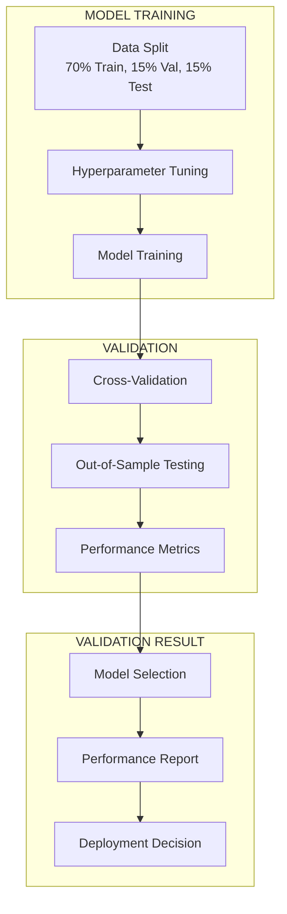

---

## 9. IMPLEMENTATION ROADMAP DAN PHASES

### 9.1 Phase 1: Foundation (Months 1-6)

#### **9.1.1 Core Framework Development**
- **VUCA Index Calculation**: Development dan validation
- **MPC Score Development**: Development dan validation
- **Integration Framework**: VUCA-MPC integration algorithms
- **Basic Predictive Models**: Initial machine learning models

#### **9.1.2 Data Infrastructure**
- **Data Sources Integration**: Connection ke external data sources
- **Data Pipeline Development**: ETL pipeline development
- **Data Quality Framework**: Data validation dan quality checks
- **Storage Architecture**: Database design dan implementation

#### **9.1.3 Basic System Architecture**
- **Core Services**: Basic microservices architecture
- **API Development**: RESTful APIs untuk core functionality
- **Basic UI**: Simple dashboard untuk core features
- **Security Framework**: Basic authentication dan authorization

### 9.2 Phase 2: Core Features (Months 7-12)

#### **9.2.1 Predictive Analytics**
- **Advanced ML Models**: Enhanced machine learning models
- **Time Series Analysis**: Advanced time series forecasting
- **Scenario Planning**: Multiple scenario analysis capabilities
- **Risk Assessment**: Comprehensive risk assessment framework

#### **9.2.2 Resource Optimization**
- **Optimization Engine**: Resource allocation optimization
- **Multi-objective Optimization**: Multi-criteria decision analysis
- **Sensitivity Analysis**: Comprehensive sensitivity analysis
- **Recommendation Engine**: Automated recommendation generation

#### **9.2.3 Advanced Analytics**
- **Real-time Analytics**: Real-time data processing dan analysis
- **Advanced Visualization**: Interactive charts dan dashboards
- **Reporting System**: Automated reporting capabilities
- **Performance Monitoring**: System performance monitoring

### 9.3 Phase 3: Advanced Features (Months 13-18)

#### **9.3.1 Advanced Intelligence**
- **Natural Language Processing**: Text analysis capabilities
- **Sentiment Analysis**: Social media dan news sentiment analysis
- **Network Analysis**: Diplomatic network analysis
- **Advanced Forecasting**: Long-term trend forecasting

#### **9.3.2 System Enhancement**
- **Mobile Application**: Mobile app untuk decision makers
- **Advanced Security**: Enhanced security features
- **Performance Optimization**: System performance optimization
- **Scalability Enhancement**: Horizontal scaling capabilities

### 9.4 Phase 4: Deployment & Optimization (Months 19-24)

#### **9.4.1 Production Deployment**
- **Production Environment**: Production environment setup
- **User Training**: Comprehensive user training program
- **Documentation**: Complete system documentation
- **Support System**: User support dan maintenance system

---

## 10. TECHNICAL IMPLEMENTATION DAN REQUIREMENTS

### 10.1 System Architecture

#### **10.1.1 Microservices Architecture**
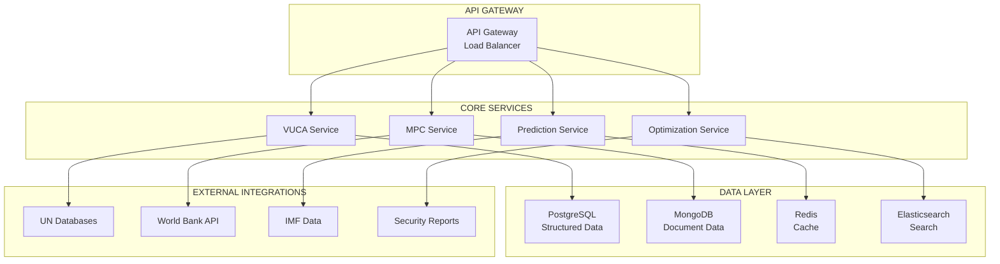

### 10.2 Technology Stack

#### **10.2.1 Backend Technologies**
- **Programming Languages**: Python 3.9+, Node.js
- **Frameworks**: FastAPI, Flask, Express.js
- **Machine Learning**: Scikit-learn, TensorFlow, PyTorch
- **Data Processing**: Pandas, NumPy, Apache Spark

#### **10.2.2 Database Technologies**
- **Primary Database**: PostgreSQL 14+
- **Document Store**: MongoDB 6.0+
- **Cache**: Redis 7.0+
- **Search Engine**: Elasticsearch 8.0+

#### **10.2.3 Infrastructure**
- **Containerization**: Docker, Kubernetes
- **Cloud Platform**: AWS, Azure, or GCP
- **Monitoring**: Prometheus, Grafana
- **CI/CD**: GitHub Actions, Jenkins

### 10.3 Data Pipeline Architecture

#### **10.3.1 ETL Pipeline**
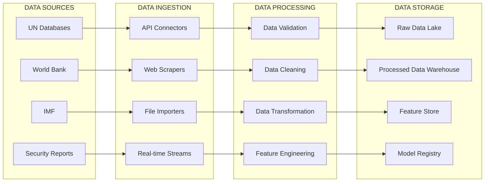

### 10.4 Security Framework

#### **10.4.1 Security Layers**
- **Authentication**: JWT tokens, OAuth 2.0
- **Authorization**: Role-based access control (RBAC)
- **Data Encryption**: AES-256 encryption at rest and in transit
- **Network Security**: HTTPS, VPN, firewall rules

#### **10.4.2 Compliance Requirements**
- **Data Protection**: GDPR compliance
- **International Standards**: ISO 27001, SOC 2
- **Government Security**: FISMA, FedRAMP (if applicable)
- **Industry Standards**: OWASP security guidelines

---

## 11. SUCCESS METRICS DAN KPIs

### 11.1 Technical Metrics

#### **11.1.1 Model Performance**
- **Predictive Accuracy**: R² > 0.8 untuk core models
- **Forecasting Accuracy**: < 15% error untuk 1-year forecasts
- **Model Stability**: < 10% performance variation over time
- **Response Time**: < 3 seconds untuk dashboard loading

#### **11.1.2 System Performance**
- **System Uptime**: > 99.5% availability
- **API Response Time**: < 500ms untuk 95% of requests
- **Data Processing Speed**: Real-time processing untuk critical data
- **Scalability**: Support untuk 1000+ concurrent users

### 11.2 Business Metrics

#### **11.2.1 User Adoption**
- **Active Users**: > 80% target user adoption
- **User Engagement**: > 60% daily active users
- **Feature Utilization**: > 70% core feature utilization
- **User Satisfaction**: > 4.0/5.0 user satisfaction score

#### **11.2.2 Policy Impact**
- **Policy Adoption**: > 60% recommendation adoption rate
- **Implementation Success**: > 80% successful implementation rate
- **Stakeholder Satisfaction**: > 4.0/5.0 stakeholder satisfaction
- **ROI Realization**: > 3x return on investment

---

## 12. STAKEHOLDER ENGAGEMENT

### 12.1 Primary Stakeholders

#### **12.1.1 Academic Stakeholders**
- **Supervisors**: Dissertation supervisors dan committee members
- **Academic Peers**: Fellow researchers dan academic community
- **Research Institutions**: Universities dan research centers
- **Academic Journals**: High-impact journals untuk publication

#### **12.1.2 Government Stakeholders**
- **Foreign Ministry**: Kementerian Luar Negeri Indonesia
- **Defense Ministry**: Kementerian Pertahanan
- **Planning Agency**: Bappenas dan regional planning agencies
- **Intelligence Agencies**: BIN dan related intelligence agencies

#### **12.1.3 International Stakeholders**
- **ASEAN Secretariat**: ASEAN coordination dan cooperation
- **UN Agencies**: UN development dan cooperation agencies
- **International Organizations**: Think tanks dan research institutions
- **Diplomatic Missions**: Foreign diplomatic missions di Indonesia

### 12.2 Engagement Strategy

#### **12.2.1 Communication Plan**
- **Regular Updates**: Monthly progress updates untuk stakeholders
- **Stakeholder Meetings**: Quarterly stakeholder meetings
- **Progress Reports**: Comprehensive progress reports
- **Feedback Integration**: Integration stakeholder feedback

---

## 13. CONCLUSION DAN NEXT STEPS

### 13.1 Summary of Solution
Framework VUCA-MPC terintegrasi ini mengatasi masalah fragmentation dengan menyediakan:

1. **Unified Framework**: Satu framework yang mengintegrasikan VUCA dan MPC
2. **Predictive Capabilities**: Machine learning untuk diplomatic success prediction
3. **Resource Optimization**: Optimal resource allocation berdasarkan predictions
4. **Practical Applications**: Implementable recommendations untuk policymakers

### 13.2 Key Innovations
- **VUCA-MPC Integration**: Framework baru yang mengintegrasikan VUCA dan MPC
- **Predictive Diplomacy**: Konsep baru dalam studi diplomasi
- **Machine Learning Integration**: Advanced analytics dalam international relations
- **Resource Optimization**: Framework untuk strategic resource allocation

### 13.3 Expected Outcomes
- **Academic Contribution**: Significant contribution to international relations theory
- **Practical Value**: Implementable framework untuk foreign policy
- **Technology Innovation**: Advanced technology integration dalam diplomacy
- **Knowledge Transfer**: Comprehensive knowledge transfer ke stakeholders

### 13.4 Next Steps

#### **13.4.1 Immediate Actions (Next 30 days)**
1. **Framework Refinement**: Refine VUCA-MPC integration framework
2. **Methodology Development**: Develop detailed methodology
3. **Data Collection Planning**: Plan comprehensive data collection
4. **Stakeholder Engagement**: Engage key stakeholders

#### **13.4.2 Short-term Actions (Next 3 months)**
1. **Model Development**: Develop initial predictive models
2. **Data Integration**: Integrate data sources
3. **System Architecture**: Design system architecture
4. **Expert Consultation**: Consult dengan expert panel

---

## 14. APPENDICES

### 14.1 Technical Specifications
- **System Architecture**: Detailed system architecture diagrams
- **Data Models**: Comprehensive data models dan schemas
- **API Specifications**: Complete API documentation
- **Security Framework**: Detailed security specifications

### 14.2 Implementation Details
- **Project Plan**: Detailed project plan dengan timelines
- **Resource Requirements**: Comprehensive resource requirements
- **Risk Management**: Detailed risk management plan
- **Quality Assurance**: Quality assurance procedures

### 14.3 Validation Framework
- **Expert Panel**: Expert panel composition dan validation process
- **Case Study Framework**: Case study selection dan analysis framework
- **Performance Metrics**: Detailed performance metrics dan benchmarks
- **Success Criteria**: Comprehensive success criteria dan evaluation framework

---

## 15. APPROVAL AND SIGN-OFF

### 15.1 Document Approval

| Role | Name | Signature | Date |
|------|------|-----------|------|
| Solution Architect | [Nama] | [Signature] | [Date] |
| Technical Lead | [Nama] | [Signature] | [Date] |
| Research Lead | [Nama] | [Signature] | [Date] |
| Supervisor | [Nama] | [Signature] | [Date] |

### 15.2 Version History

| Version | Date | Author | Changes | Approval |
|---------|------|--------|---------|----------|
| 2.0 | [Date] | [Author] | Consolidated version | [Approver] |
| 1.0 | [Date] | [Author] | Initial version | [Approver] |

---

## Mathematical Summary and Integration

### **Complete System Mathematical Framework**

**Integrated VUCA-MPC System:**
$$\mathbf{S} = \begin{bmatrix} VUCA_{composite} \\ MPC_{score} \end{bmatrix} = \begin{bmatrix} \sum_{i=1}^{4} w_i \cdot VUCA_i \\ \alpha \cdot E + \beta \cdot P + \gamma \cdot S + \delta \cdot D \end{bmatrix}$$

**State Transition Equation:**
$$\mathbf{X}_{t+1} = \mathbf{A} \mathbf{X}_t + \mathbf{B} \mathbf{u}_t + \boldsymbol{\epsilon}_t$$

**Statistical Inference Framework:**
$$P(\boldsymbol{\theta}|\mathbf{D}) \propto P(\mathbf{D}|\boldsymbol{\theta}) \cdot P(\boldsymbol{\theta})$$

**Uncertainty Quantification:**
$$U_{total} = U_{aleatory} + U_{epistemic}$$

---

## References and Further Reading

### **Mathematical Foundations**
- **Linear Algebra**: Strang, G. (2006). Linear Algebra and Its Applications
- **Optimization**: Boyd, S. & Vandenberghe, L. (2004). Convex Optimization
- **Time Series**: Hamilton, J.D. (1994). Time Series Analysis
- **Machine Learning**: Bishop, C.M. (2006). Pattern Recognition and Machine Learning

### **Statistical Methods**
- **Bayesian Statistics**: Gelman, A. et al. (2013). Bayesian Data Analysis
- **Risk Management**: McNeil, A.J. et al. (2015). Quantitative Risk Management
- **Forecasting**: Hyndman, R.J. & Athanasopoulos, G. (2018). Forecasting: Principles and Practice

---

*Dokumen ini merupakan solusi terintegrasi yang mengkonsolidasikan semua komponen dari empat dokumen terpisah menjadi satu framework VUCA-MPC yang koheren dan implementatif. Framework ini dirancang untuk memberikan kontribusi akademik yang signifikan dan nilai praktis yang tinggi untuk pengembangan kebijakan luar negeri Indonesia dalam era VUCA.*
